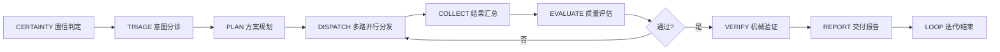
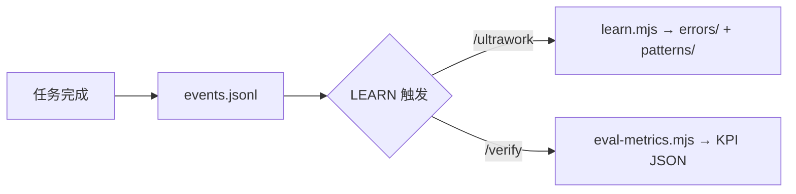

# men（门）Agent 团队

[](https://nodejs.org/) [](https://opencode.ai/) [](LICENSE) [](https://github.com/cgartlab/men) [](https://github.com/cgartlab/men/commits/main) [](https://github.com/cgartlab/men/releases)

> 围绕一人内容创作与工程协作的 **6+1 Agent 团队系统** —— OpenCode 首发，假维斯（fakevis）出品。

---

## ✨ 核心特性

| 特性 | 说明 |
|------|------|
| **6+1 角色分工** | 门（编排）· 思（思考/知识管理）· 记（代码/写作）· 持（数据/投资评审/Judge）· 艺（文生图/审美）· 寻（搜索/核查），各司其职 |
| **一键编排** | `/ultrawork` 9 步协议自动调度，多 Wave 并行分发，用户只需给任务一句话 |
| **双层机械验证** | `verify.mjs` 五项机械检查 + chi 独立 Judge 语义复核，假完成必识破 |
| **安全门禁** | `gate.mjs` 白名单防注入，强化上限 5 次防死循环 |
| **全量事件审计** | `events.jsonl` 记录 9 种事件，支持命令行回放，所有决策可追溯 |
| **零依赖脚本** | 纯 Node 运行，验证/门禁/审计三件套无第三方依赖 |
| **本地优先** | 内网数据源 + free 模型通道，SenseNova 生图仅艺角色挂载 |
| **单字命名** | 门·思·记·持·艺·寻，古典文人气质，易记好读 |
| **自主学习回路** | learn.mjs 自动提取经验写入 knowledge/，eval-metrics.mjs 计算 8 项 KPI |

---

## 🚀 快速开始

### 前置要求

- **Node.js ≥ 18**（`@opencode-ai/plugin` engines 要求）
- 已安装 [OpenCode](https://opencode.ai/) CLI

### 一键安装（推荐）

**Linux / macOS**

```bash
bash <(curl -fsSL https://raw.githubusercontent.com/cgartlab/men/main/install.sh)
```

**Windows（PowerShell 7+）**

```powershell
irm https://raw.githubusercontent.com/cgartlab/men/main/install.ps1 | iex
```

安装器会自动完成：检测 Node ≥ 18 → 拉取仓库 → 安装 `.opencode/` 依赖 → 从 `.env.example` 生成 `.env` → 运行端到端验证。

### 手动三步（备选）

1. **克隆仓库**
   ```bash
   git clone https://github.com/cgartlab/men.git men
   cd men
   ```

2. **安装依赖** — OpenCode 插件在 `.opencode/` 目录下本地安装
   ```bash
   cd .opencode && npm install && cd ..
   ```

3. **启动使用** — 在项目目录运行 opencode，默认 agent 即为 men（门）
   ```bash
   opencode
   ```

### 已安装后

```bash
cd men && opencode
```

### 三个核心命令

| 命令 | 用法 | 说明 |
|------|------|------|
| `/ultrawork` | `/ultrawork <任务描述>` | 一键编排：9 步协议自动调度多角色协作 |
| `/verify` | `/verify <角色名>` | 运行机械验证 + chi 独立 Judge 复核 |
| `/hyperplan` | `/hyperplan <项目名>` | 访谈式规划：逐层拆解复杂项目为可执行计划 |

---

## 👥 角色表

| 角色 | 中文名 | 模式 | 职责 |
|------|--------|------|------|
| **men** 🚪 | 门 | primary | 意图分诊、任务分发、结果汇总、事件审计 — 唯一接收用户指令 |
| **si** 🖊️ | 思 | subagent | 需求访谈、plan envelope、内容写作、回评 |
| **ji** 🛠️ | 记 | subagent | 前端实现、GitHub 操作、L1 机械验证、目录结构审计 |
| **chi** 💹 | 持 | subagent | 持仓/财务分析 + **独立 Judge**（fresh-context 语义复核） |
| **yi** 🎨 | 艺 | subagent | 设计决策、Logo 概念、生图（SenseNova 仅 yi 挂载） |
| **xun** 🔍 | 寻 | subagent | 网页搜索、事实核查、RSS 扫描、来源验证 |

### 协作拓扑

```
用户 → men(门, orchestrator) → si(思, planner/writer)
                                ji(记, engineer)
                                chi(持, investor + judge)
                                yi(艺, designer)
                                xun(寻, researcher)
```

men 是唯一 spawner，禁止嵌套 spawn。所有子 agent 共享 7 条全员红线。

---

## 🔄 编排流程



`/ultrawork` 遵循 9 步协议，低置信任务循环迭代，直至达到交付标准。



---

## 🛠️ 命令表

| 命令 | 用法 | 说明 |
|------|------|------|
| **ultrawork** | `/ultrawork <任务>` | 9 步协议一键编排：意图判定 → 规划 → 多路 Wave 并行 → 汇总 → 验证 → 交付 |
| **verify** | `/verify <角色>` | 运行 `scripts/verify.mjs` 五项机械检查，随后 chi 以 fresh context 独立 Judge 语义复核 |
| **hyperplan** | `/hyperplan <项目>` | 访谈式规划：逐层提问澄清需求 → 生成 plan envelope → 拆解为可执行子任务 |
| **release** | `npm run release` | 版本发布：SemVer bump + CHANGELOG + git tag（详见 [`docs/guide/release.md`](docs/guide/release.md)） |

---

## 📁 项目结构

```
men/
├── opencode.json              # OpenCode 根配置（default_agent: men, MCP×3）
├── AGENTS.md                  # 项目级共享规则（角色表/拓扑/红线/验证体系）
├── package.json               # 根配置（name/version/scripts，npm 发布载体）
├── README.md                  # 项目说明（本文件）
├── LICENSE                    # MIT 许可证
├── CONTRIBUTING.md            # 贡献指南
├── SECURITY.md                # 安全策略
├── CODE_OF_CONDUCT.md         # 行为准则
├── CHANGELOG.md               # 变更日志（Keep a Changelog 风格）
├── .env.example               # 环境变量模板（复制为 .env 后填写）
├── .gitignore                 # Git 忽略规则
├── install.sh                 # Linux/macOS 一键安装引导
├── install.ps1                # Windows 一键安装引导
│
├── .github/                   # GitHub 配置
│   ├── ISSUE_TEMPLATE/        # Issue 模板
│   ├── PULL_REQUEST_TEMPLATE.md
│   └── workflows/             # CI 工作流
│
├── .opencode/
│   ├── agent/                 # 6 个 agent 定义（唯一源代码）
│   ├── skills/                # 13 个技能包
│   ├── command/               # 自定义命令（ultrawork / verify / hyperplan）
│   ├── package.json           # @opencode-ai/plugin 本地依赖
│   └── node_modules/          # 本地依赖（不纳入版本控制）
│
├── scripts/                   # 机械脚本（纯 Node，零依赖）
│   ├── verify.mjs             # check battery — 五项机械检查
│   ├── gate.mjs               # 门禁 — 白名单 + 强化上限
│   ├── event.mjs              # 事件审计 — append/replay
│   ├── install.mjs            # 一键安装核心（跨平台）
│   └── release.mjs            # 版本发布（SemVer + CHANGELOG + tag）
│
├── config/
│   └── mcporter.json          # MCP 配置（Exa 搜索）
│
└── docs/
    ├── PRD.md                 # 产品需求文档（M0–M5 全量）
    ├── architecture.md        # 架构说明（拓扑/编排/验证）
    ├── governance.md          # 项目治理与决策机制
    ├── guide/                 # 使用指南（quickstart / milestones / release）
    ├── research/              # M0 调研产物
    ├── drafts/                # M3 验收产物
    └── m2-acceptance/         # M2 单兵验收产物
```

---

## 📚 文档导航

| 文档 | 路径 | 内容简介 |
|------|------|----------|
| **PRD** | `docs/PRD.md` | 产品需求文档，含项目定位、角色定义、核心机制、里程碑、验收标准 |
| **架构说明** | `docs/architecture.md` | 系统架构、编排流程、验证体系，含 mermaid 流程图 |
| **项目治理** | `docs/governance.md` | 决策机制、角色权限、变更流程 |
| **快速上手** | `docs/guide/quickstart.md` | 新用户入门指南，从安装到第一个 ultrawork 任务 |
| **里程碑** | `docs/guide/milestones.md` | M0–M5 进度记录、验收详情、已知问题 |
| **贡献指南** | `CONTRIBUTING.md` | 分支命名、提交规范、PR 流程、验证要求 |
| **安全策略** | `SECURITY.md` | 漏洞报告、敏感信息保护、事件响应 |
| **行为准则** | `CODE_OF_CONDUCT.md` | 社区行为规范与举报渠道 |
| **调研合成** | `docs/research/00-m0-synthesis.md` | M0 架构决策，重大变更前必读 |

---

## 🏁 里程碑状态

| M0 调研 | M1 骨架 | M2 单兵 | M3 编排 | M4 机械验证 | M5 文档 |
|---------|---------|---------|---------|-------------|---------|
| ✅ 完成 | ✅ 完成 | ✅ 完成 | ✅ 完成 | ✅ 完成 | ✅ 完成 |

> 最新进度以 [`docs/guide/milestones.md`](docs/guide/milestones.md) 为准。

---

## 🧱 技术栈

| 层级 | 技术 |
|------|------|
| Agent 框架 | [OpenCode](https://opencode.ai/) 原生 agent 定义 + 自定义 command |
| 运行时 | Node.js ≥ 18 |
| 验证体系 | 纯 Node 脚本（`verify.mjs` / `gate.mjs` / `event.mjs`），零第三方依赖 |
| MCP 工具 | Exa 搜索、Context7、grep.app |
| 设计理念 | 机械验证优先 · 不信自述 · 低置信确认 · 事件可回溯 |

---

## 🤝 贡献

欢迎通过 Issue 和 PR 参与贡献！请先阅读 [贡献指南](CONTRIBUTING.md) 了解分支命名、提交规范与验证要求。

---

## 🔒 安全

如发现安全漏洞，请参考 [安全策略](SECURITY.md) 中的方式报告，我们会在 72 小时内响应。

---

## 📜 行为准则

本项目遵循 [行为准则](CODE_OF_CONDUCT.md)，参与贡献即表示你同意遵守其条款。

---

## 📄 许可证

本项目采用 **MIT License**。详见 [LICENSE](LICENSE)。

© 2026 fakevis（假维斯）

---

## 🙏 鸣谢

- **[OpenCode](https://opencode.ai/) 团队** — 提供优秀的原生 agent 框架与 MCP 生态
- **假维斯（fakevis）团队** — 角色设计、架构决策、工程实现
- **社区贡献者** — 每一个 Issue、PR 与反馈
