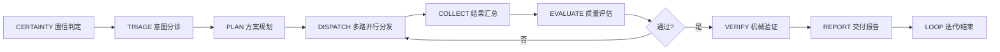
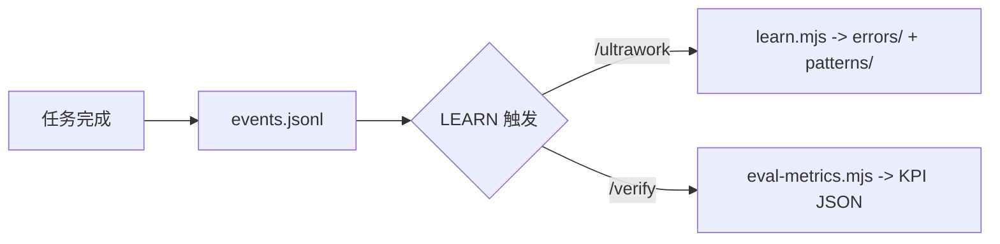

# men（门）Agent 团队

[](https://nodejs.org/) [](https://opencode.ai/) [](LICENSE) [](https://github.com/cgartlab/men) [](https://github.com/cgartlab/men/commits/main) [](https://github.com/cgartlab/men/releases)

> 围绕一人内容创作与工程协作的 **6+1 Agent 团队系统** -- OpenCode 首发，Men Agent 团队出品。

---

## 3 秒看懂

**men 是装在 OpenCode 里的 6 人 AI 团队**：你给一句话任务（"查一下…" / "写一篇…" / "评估一下…"），门（men）自动分派给思 / 记 / 持 / 艺 / 寻 五个角色协作完成，全程机械验证，绝不假报完成。

装完就能跑：

```bash
npx @cgartlab/men   # 一步安装（当前目录生效）
opencode            # 启动 OpenCode，默认 agent 即 men
/ultrawork 查一下本周 AI 开源模型动态
```

---

## 核心特性

| 特性 | 说明 |
|------|------|
| **6+1 角色分工** | **5 个子角色（思/记/持/艺/寻）+ 1 个编排者 men（门）**：门（编排）/ 思（思考/知识管理）/ 记（代码/写作）/ 持（数据/投资评审/Judge）/ 艺（文生图/审美）/ 寻（搜索/核查），各司其职 |
| **一键编排** | `/ultrawork` 10 步协议自动调度，多 Wave 并行分发，用户只需给任务一句话 |
| **双层机械验证** | `verify.mjs` 五项机械检查 + chi 独立 Judge 语义复核，假完成必识破 |
| **安全门禁** | `gate.mjs` 白名单防注入，强化上限 5 次防死循环 |
| **全量事件审计** | `events.jsonl` 记录 14 种事件，支持命令行回放，所有决策可追溯 |
| **零依赖脚本** | 纯 Node 运行，验证/门禁/审计三件套无第三方依赖 |
| **本地优先** | 内网数据源 + free 模型通道，SenseNova 生图仅艺角色挂载 |
| **单字命名** | 门/思/记/持/艺/寻，古典文人命名，简洁易记 |
| **自主学习回路** | learn.mjs 自动提取经验写入 knowledge/，eval-metrics.mjs 计算 8 项 KPI |

---

## 快速开始

### 前置要求

- **Node.js >= 18**（`@opencode-ai/plugin` engines 要求）
- 已安装 [OpenCode](https://opencode.ai/) CLI

> **环境要求**：Men 是 OpenCode 插件；模型与密钥由 CC Switch 在本地统一托管，安装无需提供密钥。环境细节见《快速上手》"使用环境"。

### 一键安装（推荐）

**方式 A：npm 一步安装（首选）**

在任意目录运行（Node >= 18 已装 OpenCode 即可）：

```bash
npx @cgartlab/men
```

> **首次 npx 会询问 "Ok to proceed? (y)"**：输入 `y` 回车即可；或直接 `npx -y @cgartlab/men` 跳过确认。

安装器自动完成：scaffold 运行时资产（`opencode.json` / `.opencode/` / `scripts/` / `config/` / `knowledge/`） -> 安装 `.opencode/` 依赖 -> 从 `.env.example` 生成 `.env` -> 端到端验证。完成后**在当前目录**运行 `opencode` 即可。

> **安装位置注意**：`npx @cgartlab/men` 会把运行时资产复制到**你当前所在的目录**，装完后 men 仅对**该目录**生效。建议在**空目录或专用目录**运行；若在已有项目目录运行，已有的 `opencode.json` / `AGENTS.md` 会被备份为 `.men.bak` 并替换（安装器会提示）。想在任何目录都显示侧边栏，安装后再执行：
> ```bash
> npx @cgartlab/men --global
> ```
> （把 men 注册为 OpenCode 全局 TUI 插件，重启 OpenCode 生效。）

**方式 B：Git 一键脚本（备选）**

**Linux / macOS**

```bash
bash <(curl -fsSL https://raw.githubusercontent.com/cgartlab/men/main/install.sh)
```

**Windows（PowerShell 7+）**

```powershell
irm https://raw.githubusercontent.com/cgartlab/men/main/install.ps1 | iex
```

安装器会自动完成：检测 Node >= 18 -> 拉取仓库 -> 安装 `.opencode/` 依赖 -> 从 `.env.example` 生成 `.env` -> 运行端到端验证。

（可选，仅当未使用 CC Switch、需手动把模型写入 opencode.json 时）运行引导式模型配置：

```bash
node scripts/setup.mjs
```

### 手动安装（备选）

1. **克隆仓库**
   ```bash
   git clone https://github.com/cgartlab/men.git men
   cd men
   ```

2. **安装依赖** -- 两种方式任选（`.opencode/package.json` 已纳入版本控制，依赖可正常解析）
   ```bash
   # 方式 A（推荐）：复用共享核心安装器，自动安装依赖 + 端到端验证
   node scripts/install.mjs

   # 方式 B：手动在 .opencode/ 下安装
   cd .opencode && npm install && cd ..
   ```

3. **（可选）引导式模型配置** -- 仅当未使用 CC Switch、需手动把模型写入 `opencode.json` 时执行
   ```bash
   node scripts/setup.mjs
   ```

4. **启动使用** -- 在项目目录运行 opencode，默认 agent 即为 men（门）
   ```bash
   opencode
   ```

### 已安装后

```bash
cd men && opencode
```

### 三个核心命令

| 命令 | 用法 | 说明 |
|------|------|------|
| `/ultrawork` | `/ultrawork <任务描述>` | 一键编排：10 步协议自动调度多角色协作 |
| `/verify` | `/verify <角色名>` | 运行机械验证 + chi 独立 Judge 复核 |
| `/hyperplan` | `/hyperplan <项目名>` | 深度思考与方案规划：多角度拆解复杂项目为可执行计划 |

---

## 角色表

| 角色 | 中文名 | 模式 | 职责 |
|------|--------|------|------|
| **men** | 门 | primary | 意图分诊、任务分发、结果汇总、事件审计 -- 唯一接收用户指令 |
| **si** | 思 | subagent | 需求访谈、plan envelope、知识管理、回评（写作已移交 ji） |
| **ji** | 记 | subagent | 前端实现、GitHub 操作、L1 机械验证、目录结构审计 |
| **chi** | 持 | subagent | 持仓/财务分析 + **独立 Judge**（fresh-context 语义复核） |
| **yi** | 艺 | subagent | 设计决策、Logo 概念、生图（SenseNova 仅 yi 挂载） |
| **xun** | 寻 | subagent | 网页搜索、事实核查、RSS 扫描、来源验证 |

### 协作拓扑

```
用户 -> men(门, orchestrator) -> si(思, planner/knowledge)
                                ji(记, engineer)
                                chi(持, investor + judge)
                                yi(艺, designer)
                                xun(寻, researcher)
```

men 是唯一 spawner，禁止嵌套 spawn。所有子 agent 共享 7 条全员红线。

---

## 编排流程



`/ultrawork` 遵循 10 步协议，低置信任务循环迭代，直至达到交付标准。



---

## 命令表

| 命令 | 用法 | 说明 |
|------|------|------|
| **ultrawork** | `/ultrawork <任务>` | 10 步协议一键编排：意图判定 -> 规划 -> 多路 Wave 并行 -> 汇总 -> 验证 -> 交付 |
| **verify** | `/verify <角色>` | 运行 `scripts/verify.mjs` 五项机械检查，随后 chi 以 fresh context 独立 Judge 语义复核 |
| **hyperplan** | `/hyperplan <项目>` | 深度思考与方案规划：多角度提出方案 -> 生成 plan envelope -> 拆解为可执行子任务 |
| **release** | `npm run release` | 版本发布：SemVer bump + CHANGELOG + git tag（详见 [`docs/guide/release.md`](docs/guide/release.md)） |

---

## 项目结构

```
men/
|-- opencode.json              # OpenCode 根配置（default_agent: men；不含 MCP 配置，由 CC Switch 统一管理）
|-- AGENTS.md                  # 项目级共享规则（角色表/拓扑/红线/验证体系）
|-- package.json               # 根配置（name/version/scripts，npm 发布载体）
|-- README.md                  # 项目说明（本文件）
|-- LICENSE                    # MIT 许可证
|-- CONTRIBUTING.md            # 贡献指南
|-- SECURITY.md                # 安全策略
|-- CODE_OF_CONDUCT.md         # 行为准则
|-- CHANGELOG.md               # 变更日志（Keep a Changelog 风格）
|-- .env.example               # 环境变量模板（复制为 .env 后填写）
|-- .gitignore                 # Git 忽略规则
|-- install.sh                 # Linux/macOS 一键安装引导
|-- install.ps1                # Windows 一键安装引导
|
|-- .github/                   # GitHub 配置
|   |-- ISSUE_TEMPLATE/        # Issue 模板
|   |-- PULL_REQUEST_TEMPLATE.md
|   +-- workflows/             # CI 工作流
|
|-- .opencode/
|   |-- agent/                 # 6 个 agent 定义（唯一源代码）
|   |-- skills/                # 15 个技能包
|   |-- command/               # 自定义命令（ultrawork / verify / hyperplan）
|   |-- plugins/               # 自动化插件（men-verify 产物验证 / men-learn 学习回路）
|   |   +-- men-sidebar/       # TUI 侧边栏（index.js / tui.js / update-check.mjs）
|   |-- tui.json               # TUI 侧边栏入口声明
|   |-- package.json           # @opencode-ai/plugin + @opentui/* 本地依赖
|   +-- node_modules/          # 本地依赖（不纳入版本控制）
|
|-- scripts/                   # 机械脚本（纯 Node，零依赖，共 17 个）
|   |-- verify.mjs             # check battery -- 五项机械检查
|   |-- gate.mjs               # 门禁 -- 白名单 + 强化上限
|   |-- event.mjs              # 事件审计 -- append/replay
|   |-- install.mjs            # 一键安装核心（跨平台）
|   |-- setup.mjs              # 引导式模型配置
|   |-- release.mjs            # 版本发布（SemVer + CHANGELOG + tag）
|   |-- learn.mjs              # 学习回路主入口（L0 聚合 + L1 分类）
|   |-- learn-rules.mjs        # 学习规则判定表
|   |-- learn-budget.mjs       # 学习预算控制
|   |-- eval-metrics.mjs       # 8 项 KPI 评估
|   |-- eval-report.mjs        # 评估报告生成
|   |-- route-hint.mjs         # 角色路由提示
|   |-- release-notes.mjs      # 发布说明生成
|   |-- update-release-page.mjs # 站点发布页同步（releases.astro）
|   |-- learning.test.mjs      # 学习回路测试（17 用例）
|   |-- smoke-update-check.mjs # 更新检查冒烟测试
|   +-- fix-port-4096.ps1      # 修复 OpenCode 端口 4096 占用
|
|-- config/
|   +-- models.json            # 模型知识基（setup.mjs 数据源）
|
+-- docs/
    |-- PRD.md                 # 产品需求文档（M0-M5 全量）
    |-- architecture.md        # 架构说明（拓扑/编排/验证）
    |-- governance.md          # 项目治理与决策机制
    |-- guide/                 # 使用指南（quickstart / milestones / release）
    |-- research/              # M0 调研产物
    |-- drafts/                # M3 验收产物
    +-- m2-acceptance/         # M2 单兵验收产物
```

---

## 文档导航

| 文档 | 路径 | 内容简介 |
|------|------|----------|
| **PRD** | `docs/PRD.md` | 产品需求文档，含项目定位、角色定义、核心机制、里程碑、验收标准 |
| **架构说明** | `docs/architecture.md` | 系统架构、编排流程、验证体系，含 mermaid 流程图 |
| **项目治理** | `docs/governance.md` | 决策机制、角色权限、变更流程 |
| **快速上手** | `docs/guide/quickstart.md` | 新用户入门指南，从安装到第一个 ultrawork 任务 |
| **里程碑** | `docs/guide/milestones.md` | M0-M7 进度记录、验收详情、已知问题 |
| **贡献指南** | `CONTRIBUTING.md` | 分支命名、提交规范、PR 流程、验证要求 |
| **安全策略** | `SECURITY.md` | 漏洞报告、敏感信息保护、事件响应 |
| **行为准则** | `CODE_OF_CONDUCT.md` | 社区行为规范与举报渠道 |
| **调研合成** | `docs/research/00-m0-synthesis.md` | M0 架构决策，重大变更前必读 |

---

## 里程碑状态

| M0 调研 | M1 骨架 | M2 单兵 | M3 编排 | M4 机械验证 | M5 文档 | M6 GitHub 基础设施 | M7 自主学习回路 |
|---------|---------|---------|---------|-------------|---------|---------------------|-----------------|
| 完成 | 完成 | 完成 | 完成 | 完成 | 完成 | 完成 | 完成 |

> 最新进度以 [`docs/guide/milestones.md`](docs/guide/milestones.md) 为准。

---

## 技术栈

| 层级 | 技术 |
|------|------|
| Agent 框架 | [OpenCode](https://opencode.ai/) 原生 agent 定义 + 自定义 command |
| 运行时 | Node.js >= 18 |
| 验证体系 | 纯 Node 脚本（`verify.mjs` / `gate.mjs` / `event.mjs`），零第三方依赖 |
| MCP 工具 | 由 CC Switch 统一管理（仓库不携带 mcp 配置；模型/密钥/MCP 均本地托管） |
| 设计理念 | 机械验证优先 / 不信自述 / 低置信确认 / 事件可回溯 |

---

## 贡献

欢迎通过 Issue 和 PR 参与贡献！请先阅读 [贡献指南](CONTRIBUTING.md) 了解分支命名、提交规范与验证要求。

---

## 安全

如发现安全漏洞，请参考 [安全策略](SECURITY.md) 中的方式报告，我们会在 72 小时内响应。

---

## 行为准则

本项目遵循 [行为准则](CODE_OF_CONDUCT.md)，参与贡献即表示你同意遵守其条款。

---

## 许可证

本项目采用 **MIT License**。详见 [LICENSE](LICENSE)。

(c) 2026 Men Agent 团队

---

## 鸣谢

- **[OpenCode](https://opencode.ai/) 团队** -- 提供优秀的原生 agent 框架与 MCP 生态
- **Men Agent 团队** -- 角色设计、架构决策、工程实现
- **社区贡献者** -- 每一个 Issue、PR 与反馈
