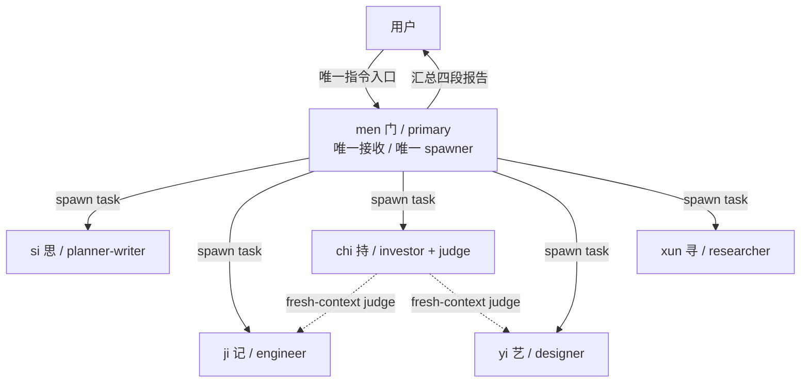
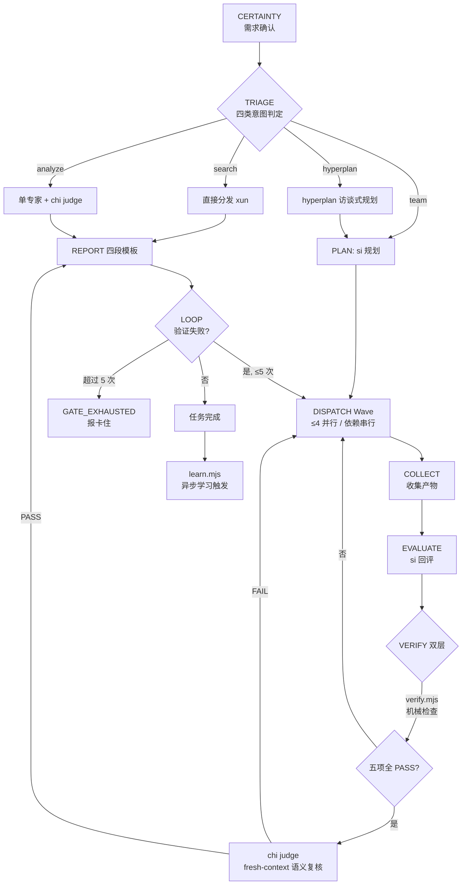
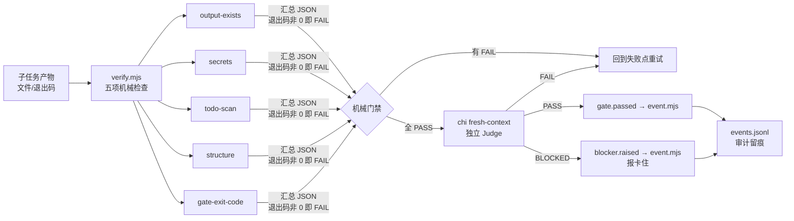
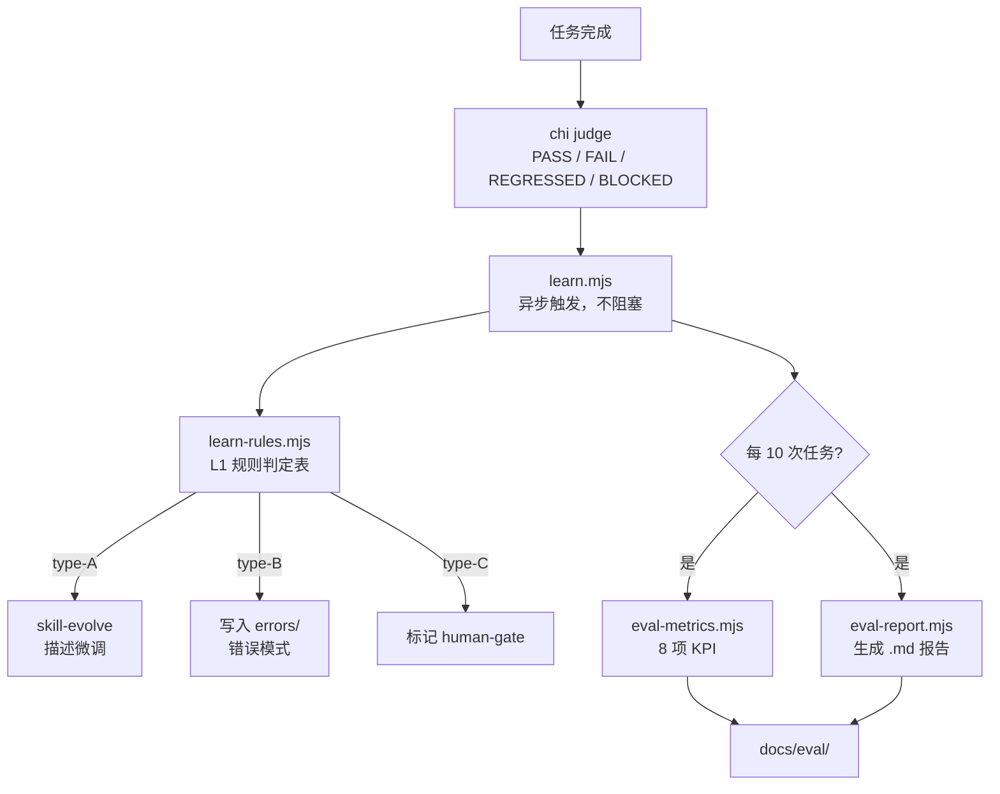

# 架构说明（Architecture）— 假维斯（men Agent 团队）

> 版本：M7 ｜ 日期：2026-08-21
> 关联：`docs/research/00-m0-synthesis.md` 提供上游调研与决策来源

---

## 一、协作拓扑



- **men 唯一 primary**：用户只与 men 对话，所有用户输入先经 men 分诊
- **men 唯一 spawner**：5 个 subagent 之间禁止互相 spawn（无嵌套）
- **chi 双重角色**：既是投资分析角色，又是所有 analyze / team 任务的独立 Judge

---

## 二、双 Harness 兼容层

本项目同时运行在两套 Agent 框架上，共享同一套 skills 与 scripts：

```
┌─────────────────────────────────────────────────────────────────┐
│                    OpenCode（主框架）                              │
│                                                                 │
│  opencode.json ──→ .opencode/agent/*.md（6 agents）              │
│           └──→ .opencode/skills/*/SKILL.md（13 skills）          │
│           └──→ .opencode/command/*.md（3 commands）              │
└─────────────────────────────────────────────────────────────────┘
                                ↕ 共享
┌─────────────────────────────────────────────────────────────────┐
│                    Pi Harness（兼容层）                            │
│                                                                 │
│  package.json → pi.manifest ──→ .pi/agents/*.md（5 agents）      │
│           └──→ .pi/skills/ (junction) → .opencode/skills/       │
│           └──→ prompts/*.md（3 templates）                       │
│           └──→ .pi/APPEND_SYSTEM.md（men orchestrator）           │
└─────────────────────────────────────────────────────────────────┘
                                ↕ 共享
┌─────────────────────────────────────────────────────────────────┐
│                    底层（两套框架共用）                              │
│                                                                 │
│  scripts/*.mjs（纯 Node 零依赖）→ knowledge/ → events.jsonl      │
└─────────────────────────────────────────────────────────────────┘
```

**核心设计原则**：上层（agent 定义）按框架不同而分离，下层（skills / scripts / knowledge）完全共享。

### 2.1 目录映射

| 功能 | OpenCode | Pi Harness |
|------|----------|-----------|
| 根配置 | `opencode.json` | `package.json` → `pi` 字段 |
| Agent 定义 | `.opencode/agent/*.md` | `.pi/agents/*.md` |
| Skills | `.opencode/skills/` | `.pi/skills/` junction → 同上 |
| 命令模板 | `.opencode/command/` | `prompts/` |
| Orchestrator | `.opencode/agent/men.md` | `.pi/APPEND_SYSTEM.md` |

### 2.2 桥接机制

- **Skills**：Windows Junction（`.pi/skills/` → `.opencode/skills/`），Node.js fs 透明跟随
- **Scripts**：纯 Node 零依赖，Pi bash 与 OpenCode 均可直接调用
- **Knowledge**：`.opencode/knowledge/` 与 `.pi/knowledge/` 共享同一目录
- **Events**：两套框架统一写入 `.agents/state/sessions/<sid>/events.jsonl`

---

## 三、编排流程（ultrawork）



9 步协议：`CERTAINTY → TRIAGE → PLAN → DISPATCH → COLLECT → EVALUATE → VERIFY → REPORT → LOOP`
任务完成后异步触发学习闭环（`learn.mjs`，不阻塞主流程）。

---

## 四、验证体系



- **gate.mjs**：stop-hook 门禁（白名单 typecheck/test/lint，60s 超时，强化上限 5）
- **event.mjs**：append-only events.jsonl（append / list / replay / validate 四子命令）
- **全部纯 Node 零依赖**，Windows pwsh 兼容

---

## 五、自主学习架构



详见 [`docs/learning-architecture.md`](learning-architecture.md)。

---

## 六、目录结构

```
men/
├── opencode.json              # OpenCode 根配置
├── AGENTS.md                  # 项目级共享规则
├── package.json               # 根配置（含 pi manifest）
├── README.md                  # 项目入口
├── LICENSE / CHANGELOG.md     # 许可证 + 变更日志
├── .env.example               # 环境变量模板
├── .gitignore                 # Git 忽略规则
│
├── .opencode/                 # OpenCode 原生配置
│   ├── agent/                 # 6 个 agent 定义（唯一源代码）
│   ├── skills/                # 13 个技能包
│   ├── command/               # 3 个自定义命令
│   ├── package.json           # @opencode-ai/plugin 1.18.18
│   └── .gitignore
│
├── .pi/                       # Pi Harness 兼容层
│   ├── settings.json          # 包声明
│   ├── APPEND_SYSTEM.md       # men 编排指令
│   ├── agents/                # 5 个子 agent 定义
│   └── skills/                # junction → .opencode/skills/
│
├── prompts/                   # Pi prompt 模板
│   ├── ultrawork.md
│   ├── hyperplan.md
│   └── verify.md
│
├── scripts/                   # 纯 Node 零依赖
│   ├── verify.mjs             # 五项机械检查
│   ├── gate.mjs               # 白名单门禁
│   ├── event.mjs              # 事件审计
│   ├── learn.mjs              # 学习闭环
│   ├── learn-rules.mjs        # L1 规则判定
│   ├── learn-budget.mjs       # 学习成本控制
│   ├── eval-metrics.mjs       # KPI 采集
│   ├── eval-report.mjs        # 评估报告
│   ├── install.mjs            # 一键安装
│   └── release.mjs            # 版本发布
│
├── knowledge/                 # 团队知识库
├── .agents/state/             # 事件审计 + 学习状态
├── config/mcporter.json       # MCP 配置
└── docs/                      # 项目文档
    ├── PRD.md
    ├── architecture.md        # 本文档
    ├── learning-architecture.md
    ├── guide/
    ├── research/
    ├── m2-acceptance/
    └── drafts/
```

---

## 七、技术决策记录

| # | 决策 | 依据 | 状态 |
|---|------|------|------|
| D1 | **men 唯一 primary**，用户只与 men 对话 | PRD 编排要求 + OmO orchestrator 模式 | 已落地 |
| D2 | **men 唯一 spawner**，subagent 禁止嵌套 spawn | 降低复杂度、避免递归失控 | 已落地 |
| D3 | **机械验证优先**，拒绝 LLM 自评 | oma 机械门禁哲学 + M0 调研结论 | 已落地 |
| D4 | **双层验证**：verify.mjs 机械 + chi fresh-context 语义 | F4 机械验证体系映射 | 已落地 |
| D5 | **M1 先不做插件**，OpenCode 原生 agent 定义 + command 起步 | 降低初始复杂度 | 已落地 |
| D6 | **本地优先**：数据源内网（192.168.31.x），SenseNova 生图仅 yi 挂载 | PRD G6 + OmO 3 层 MCP 分层 | 已落地 |
| D7 | **意图分类用规则判定表**，不用 LLM 分类 | 机械优先 + PRD §3.1 | 已落地 |
| D8 | **强化次数上限 5 次**，超限诚实报"卡住" | oma MAX_REINFORCEMENTS=5 | 已落地 |
| D9 | **事件审计 best-effort**，命令失败不阻塞主流程 | oma events.jsonl 规范 | 已落地 |
| D10 | **命名暂定 men（门）**，团队名暂定 fakevis（假维斯） | 命名可后续调整 | 已落地 |
| D11 | **双 Harness 兼容**：OpenCode 主框架 + Pi 兼容层 | 降低跨框架迁移成本 | 已落地（M7） |
| D12 | **学习后台异步**：不阻塞主流程，best-effort | 用户等待时间优先 | 已落地（M6） |
| D13 | **skills 共享**：`.pi/skills/` junction 桥接 `.opencode/skills/` | 同一套 skills 两套框架共用 | 已落地（M7） |
| D14 | **跨运行时 adapter**（Codex / OpenClaw） | 未进入当前里程碑 | 待 M7 后 |
