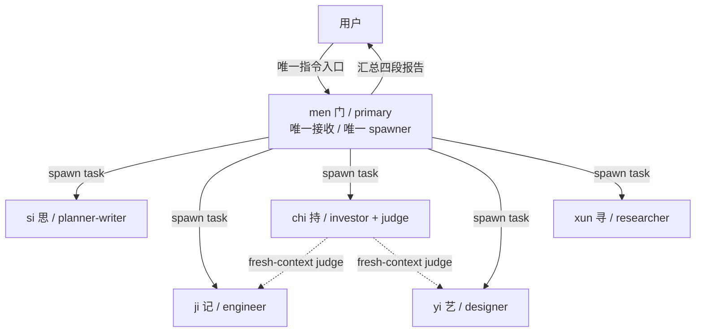
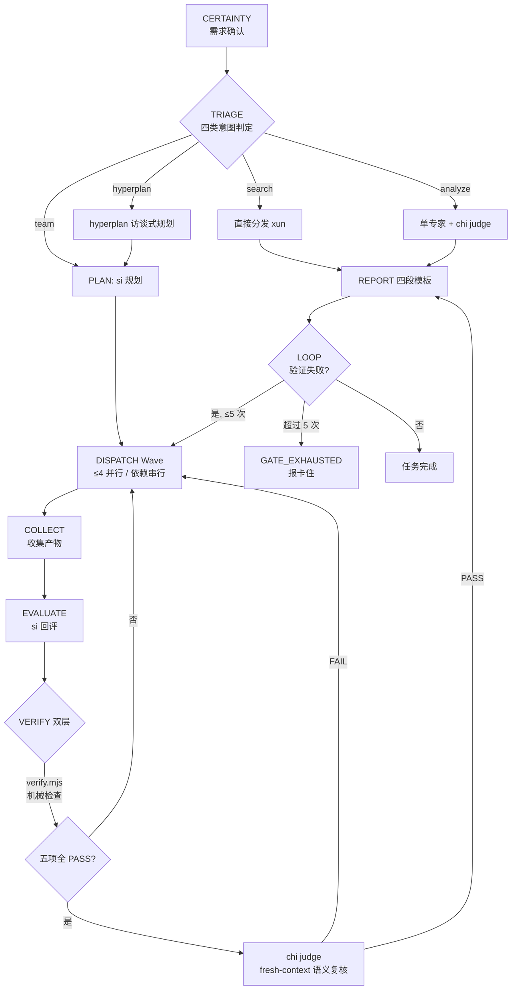
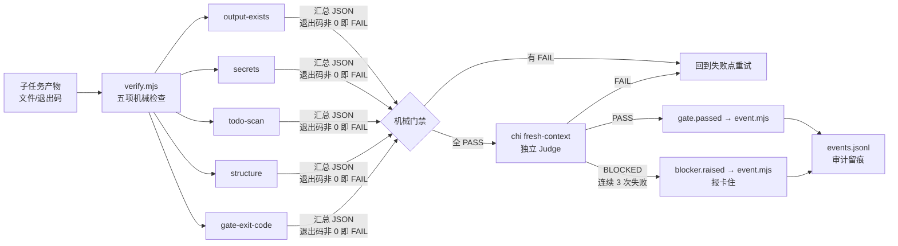

# 架构说明（Architecture）— 假维斯（men Agent 团队）

> 版本：M5 ｜ 日期：2026-08-15
> 关联：`docs/research/00-m0-synthesis.md` 提供上游调研与决策来源

---

## 一、协作拓扑



- **men 唯一 primary**：用户只与 men 对话，所有用户输入先经 men 分诊
- **men 唯一 spawner**：5 个 subagent 之间禁止互相 spawn（无嵌套）
- **chi 双重角色**：既是投资分析角色，又是所有 analyze / team 任务的独立 Judge

## 二、编排流程（ultrawork）



9 步协议：`CERTAINTY → TRIAGE → PLAN → DISPATCH → COLLECT → EVALUATE → VERIFY → REPORT → LOOP`

## 三、验证体系



- **gate.mjs**：stop-hook 门禁（白名单 typecheck/test/lint，60s 超时，强化次数上限 5）
- **event.mjs**：append-only events.jsonl（append / list / replay / validate 四子命令）
- **全部纯 Node 零依赖**，Windows pwsh 兼容

## 四、目录结构

```
men/
├── AGENTS.md                   ← 项目级共享规则（红线 / Charter / 目录结构）
├── opencode.json               ← default_agent: men + MCP×3（exa/context7/grep_app）
├── config/
│   └── mcporter.json           ← MCP 配置
├── .opencode/
│   ├── agent/
│   │   ├── men.md              ← 编排核心（primary）
│   │   ├── si.md               ← 规划/写作（subagent）
│   │   ├── ji.md               ← 代码工程（subagent）
│   │   ├── chi.md              ← 投资/评审（subagent + judge）
│   │   ├── yi.md               ← 视觉设计（subagent）
│   │   └── xun.md              ← 搜索研究（subagent）
│   ├── skills/                 ← 13 个 skill（每个含 SKILL.md + frontmatter）
│   │   ├── chi-invest / chi-judge
│   │   ├── ji-frontend-design / ji-github / ji-l1-verify
│   │   ├── si-content-write / si-knowledge / si-plan-compose
│   │   ├── xun-factcheck / xun-rss-scan / xun-search
│   │   └── yi-design / yi-imagegen
│   ├── command/
│   │   ├── ultrawork.md        ← 一键编排（9 步协议）
│   │   ├── verify.md           ← 双层验证（verify.mjs + chi judge）
│   │   └── hyperplan.md        ← 访谈式规划
│   ├── package.json            ← @opencode-ai/plugin 1.18.18（本地安装）
│   └── .gitignore
├── .agents/
│   └── state/
│       └── sessions/           ← events.jsonl 事件审计
│           └── <sid>/events.jsonl
├── scripts/                    ← 纯 Node 零依赖
│   ├── verify.mjs              ← 五项机械检查
│   ├── gate.mjs                ← stop-hook 门禁
│   └── event.mjs               ← events.jsonl 读写
├── docs/
│   ├── PRD.md                  ← 产品需求文档
│   ├── architecture.md         ← 本文档
│   ├── research/               ← M0 调研笔记
│   ├── guide/
│   │   ├── quickstart.md       ← 快速上手
│   │   └── milestones.md       ← 里程碑进度
│   ├── m2-acceptance/          ← M2 验收产物
│   └── drafts/                 ← 任务产物草稿
└── oh-my-openagent/            ← 上游参考 clone
```

## 五、技术决策记录

| # | 决策 | 依据 | 状态 |
|---|------|------|------|
| D1 | **men 唯一 primary**，用户只与 men 对话 | PRD 编排要求 + OmO orchestrator 模式 | 已落地 |
| D2 | **men 唯一 spawner**，subagent 禁止嵌套 spawn | 降低复杂度、避免递归失控 | 已落地 |
| D3 | **机械验证优先**，拒绝 LLM 自评 | oma 机械门禁哲学 + M0 调研结论 | 已落地 |
| D4 | **双层验证**：verify.mjs 机械 + chi fresh-context 语义 | F4 机械验证体系映射 | 已落地 |
| D5 | **M1 先不做插件**，OpenCode 原生 agent 定义 + command 起步 | 降低初始复杂度；插件化留到 M5 后 | 已落地 |
| D6 | **本地优先**：数据源内网（192.168.31.x），SenseNova 生图仅 yi 挂载 | PRD G6 + omO 3 层 MCP 分层 | 已落地 |
| D7 | **意图分类用规则判定表**，不用 LLM 分类 | 机械优先 + PRD §3.1 | 已落地 |
| D8 | **强化次数上限 5 次**，超限诚实报"卡住" | oma MAX_REINFORCEMENTS=5 | 已落地 |
| D9 | **事件审计 best-effort**，命令失败不阻塞主流程 | oma events.jsonl 规范 | 已落地 |
| D10 | **命名暂定 men（门）**，团队名暂定 fakevis（假维斯） | 命名可后续调整 | 已落地 |
| D11 | **adapter 后续适配 Codex / OpenClaw** | 跨运行时复用，未进入当前里程碑 | 待 M5 后 |
| D12 | **技术栈 TypeScript + Bun** | 两上游一致，OpenCode 插件生态 | 已落地（脚本侧用纯 Node） |
