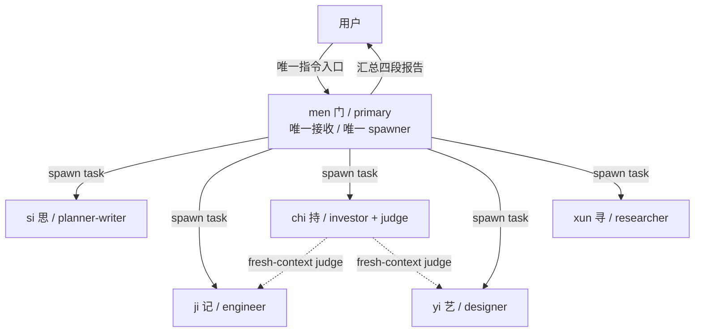
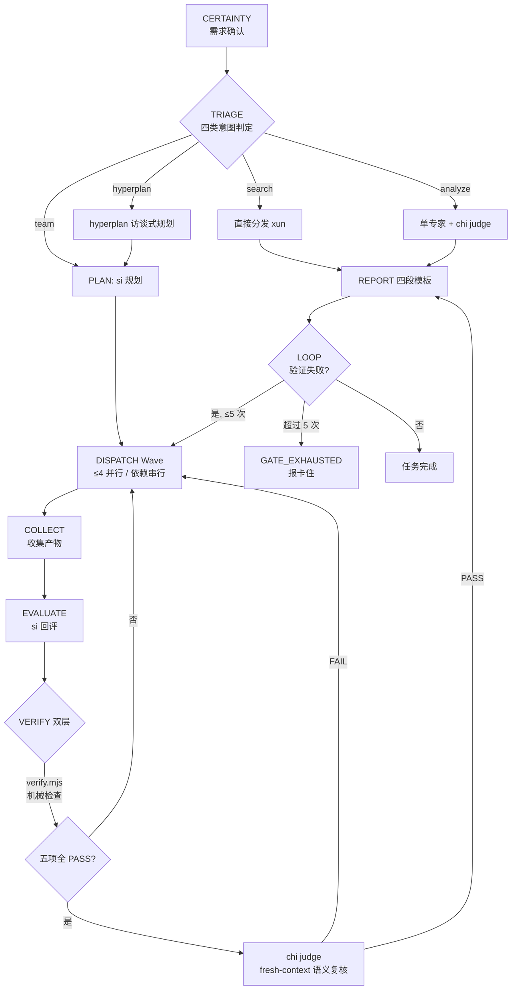
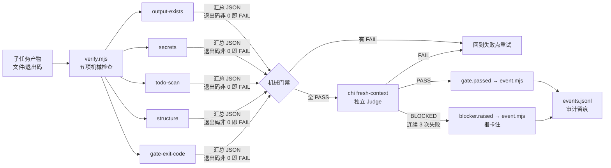
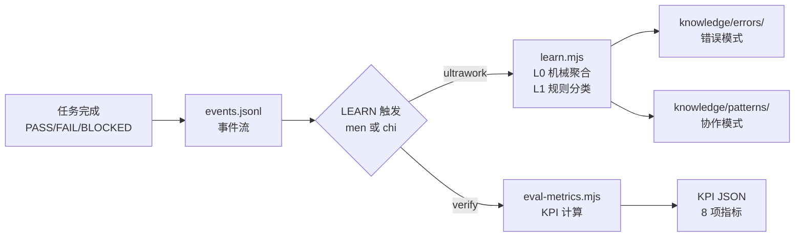

# 架构说明（Architecture）— 假维斯（men Agent 团队）

> 版本：M7 ｜ 日期：2026-08-21
> 关联：`docs/research/00-m0-synthesis.md` 提供上游调研与决策来源

---

## 一、协作拓扑



- **men 唯一 primary**：用户只与 men 对话，所有用户输入先经 men 分诊
- **men 唯一 spawner**：5 个 subagent 之间禁止互相 spawn（无嵌套）
- **chi 双重角色**：既是投资分析角色，又是所有 analyze / team 任务的独立 Judge

## 二、编排流程（ultrawork）



9 步协议：`CERTAINTY → TRIAGE → PLAN → DISPATCH → COLLECT → EVALUATE → VERIFY → REPORT → LOOP`

### 10. LEARN（M7 新增）

`/ultrawork` 完成后，men 触发 `node scripts/learn.mjs --sid <sid> --json`：
- 从 events.jsonl 提取经验（type-A/B/C 分类）
- 写入 `knowledge/errors/`（错误模式）和 `knowledge/patterns/`（协作模式）
- best-effort，不阻塞 REPORT

`/verify` 完成后，chi 触发 `node scripts/eval-metrics.mjs --sid <sid> --json`：
- 从 events.jsonl 计算 8 项 KPI（最近 10 次任务窗口）
- 输出通过率、回归率、平均耗时等指标
- best-effort，不阻塞 Judge 报告

## 三、验证体系



- **gate.mjs**：stop-hook 门禁（白名单 typecheck/test/lint，60s 超时，强化次数上限 5）
- **event.mjs**：append-only events.jsonl（append / list / replay / validate 四子命令）
- **全部纯 Node 零依赖**，Windows pwsh 兼容

### 学习回路（M7）



## 四、目录结构

```
men/
├── AGENTS.md                   ← 项目级共享规则（红线 / Charter / 目录结构）
├── README.md                   ← 项目首页（徽章 / 特性 / 安装 / 角色 / 命令）
├── LICENSE                     ← MIT 许可证
├── CONTRIBUTING.md             ← 贡献指南
├── SECURITY.md                 ← 安全策略
├── CODE_OF_CONDUCT.md          ← 行为准则
├── CHANGELOG.md                ← 变更日志（Keep a Changelog）
├── package.json                ← 包管理（版本 / scripts / files 白名单）
├── .env.example                ← 环境变量模板
├── install.sh                  ← Linux/macOS 一键安装引导
├── install.ps1                 ← Windows 一键安装引导
│
├── opencode.json               ← default_agent: men + MCP×7（exa/context7/grep_app/fetch/github/memory/sequential-thinking）
├── config/
│   └── mcporter.json           ← MCP 配置（Exa 搜索）
│
├── .opencode/
│   ├── agent/                  ← 6 个 agent 定义
│   │   ├── men.md              ← 门 — 编排与路由
│   │   ├── si.md               ← 思 — 规划与写作
│   │   ├── ji.md               ← 记 — 代码与工程
│   │   ├── chi.md              ← 持 — 投资与评审
│   │   ├── yi.md               ← 艺 — 视觉设计
│   │   └── xun.md              ← 寻 — 搜索与研究
│   ├── skills/                 ← 13 个 skill
│   │   ├── chi-invest / chi-judge
│   │   ├── ji-frontend-design / ji-github / ji-l1-verify
│   │   ├── ji-content-write / si-knowledge / si-plan-compose
│   │   ├── xun-factcheck / xun-rss-scan / xun-search
│   │   └── yi-design / yi-imagegen
│   ├── command/                ← 3 个自定义命令
│   │   ├── ultrawork.md        ← 一键编排
│   │   ├── verify.md           ← 验证命令
│   │   └── hyperplan.md        ← 访谈式规划
│   ├── package.json            ← @opencode-ai/plugin 本地依赖
│   └── .gitignore
│
├── .github/
│   ├── workflows/
│   │   └── ci.yml              ← CI 工作流
│   ├── PULL_REQUEST_TEMPLATE.md
│   ├── ISSUE_TEMPLATE/         ← bug_report + feature_request（.md + .yml）
│   ├── CODEOWNERS
│   ├── FUNDING.yml
│   ├── dependabot.yml
│   └── projects.json
│
├── scripts/                    ← 纯 Node 零依赖脚本
│   ├── verify.mjs              ← 五项机械检查
│   ├── gate.mjs                ← 门禁
│   ├── event.mjs               ← 事件审计
│   ├── install.mjs             ← 一键安装核心
│   ├── release.mjs             ← 版本发布
│   ├── learn.mjs               ← 自主学习循环入口
│   ├── learn-rules.mjs         ← 学习分类规则
│   ├── learn-budget.mjs        ← 学习预算
│   ├── eval-metrics.mjs        ← 评估指标计算
│   ├── eval-report.mjs         ← 评估报告生成
│   ├── fix-port-4096.ps1       ← 端口修复
│   └── sync-to-opencode.ps1    ← OpenCode 全局同步
│
├── docs/
│   ├── PRD.md
│   ├── architecture.md
│   ├── governance.md           ← 团队治理
│   ├── learning-architecture.md ← 自主学习架构
│   ├── guide/
│   │   ├── quickstart.md
│   │   ├── milestones.md
│   │   └── release.md
│   ├── research/
│   │   ├── 00-m0-synthesis.md
│   │   ├── oh-my-agent.md
│   │   ├── oh-my-openagent.md
│   │   └── 05-agents-autonomous-evolution-sota.md
│   ├── m2-acceptance/
│   └── drafts/
│
├── knowledge/                  ← 团队知识库
│   ├── errors/                 ← 错误模式
│   ├── patterns/               ← 模式库
│   └── decisions/              ← 决策记录
│
├── .agents/state/
│   ├── sessions/               ← events.jsonl 事件审计
│   ├── gates/                  ← gate 状态文件
│   └── learn/                  ← 学习队列
```

## 五、技术决策记录

| # | 决策 | 依据 | 状态 |
|---|------|------|------|
| D1 | **men 唯一 primary**，用户只与 men 对话 | PRD 编排要求 + OmO orchestrator 模式 | 已落地 |
| D2 | **men 唯一 spawner**，subagent 禁止嵌套 spawn | 降低复杂度、避免递归失控 | 已落地 |
| D3 | **机械验证优先**，拒绝 LLM 自评 | oma 机械门禁哲学 + M0 调研结论 | 已落地 |
| D4 | **双层验证**：verify.mjs 机械 + chi fresh-context 语义 | F4 机械验证体系映射 | 已落地 |
| D5 | **M1 先不做插件**，OpenCode 原生 agent 定义 + command 起步 | 降低初始复杂度；插件化留到 M5 后 | 已落地 |
| D6 | **本地优先**：数据源内网（192.168.31.x），SenseNova 生图仅 yi 挂载 | PRD G6 + omO 3 层 MCP 分层 | 已落地 |
| D7 | **意图分类用规则判定表**，不用 LLM 分类 | 机械优先 + PRD §3.1 | 已落地 |
| D8 | **强化次数上限 5 次**，超限诚实报"卡住" | oma MAX_REINFORCEMENTS=5 | 已落地 |
| D9 | **事件审计 best-effort**，命令失败不阻塞主流程 | oma events.jsonl 规范 | 已落地 |
| D10 | **命名暂定 men（门）**，团队名暂定 fakevis（假维斯） | 命名可后续调整 | 已落地 |
| D11 | **adapter 后续适配 Codex / OpenClaw** | 跨运行时复用，未进入当前里程碑 | 待 M5 后 |
| D12 | **技术栈 TypeScript + Bun** | 两上游一致，OpenCode 插件生态 | 已落地（脚本侧用纯 Node） |
| D13 | **自主学习回路**（M5+ 增量） | 四层认知模型（评估/认知/行为/记忆），L0/L1/L2 三级触发，events.jsonl → learn.mjs → errors/ + patterns/ | 已落地 |
| D14 | **GitHub 标准化**（M6） | LICENSE/CONTRIBUTING/SECURITY/CODE_OF_CONDUCT/PR&Issue 模板/CODEOWNERS/dependabot/CI workflow | 已落地 |
| D15 | **MIT 许可证** | 替代 Apache-2.0，简化贡献流程 | 已落地 |
| D16 | **自主学习已验证** | learn.mjs 对历史 ultrawork 会话正确提取 REVISION_NEEDED 错误模式；eval-metrics 8 项 KPI 全部计算 | 已落地 |
| D17 | **事件类型归一化** | learn-rules.mjs 和 eval-metrics.mjs 均支持 men.* 前缀映射，兼容 ultrawork 事件格式 | 已落地 |
| D18 | **Ji 承担写作职责** | 用户确认 Ji 原始设计含写作，写作从 si 移交 ji（ji-content-write skill），si 专注规划与知识管理 | 已落地 |
| D19 | **学习回流闭环**（R1-R5） | men 路由前读 knowledge/patterns + route-hint.mjs；learn.mjs --apply 转门禁；chi plan review 类型；KPI 落盘 | 已落地 |
