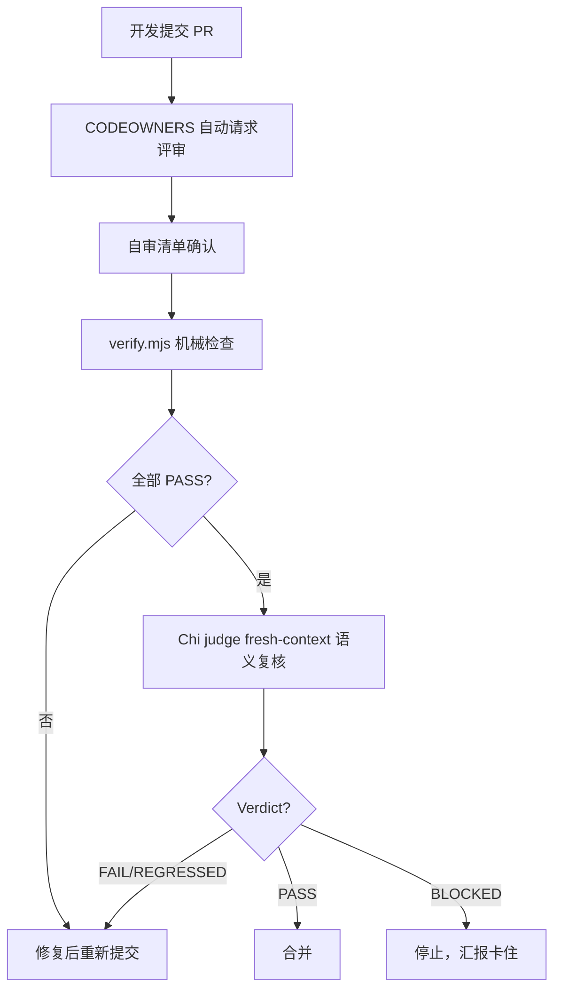

# 团队治理（Governance）— Men Agent 团队

> 版本：v0.3.5 ｜ 日期：2026-08-28
> 定位：定义 6+1 Agent 团队的协作规则、决策流程、质量门禁与发布策略

---

## 一、角色与责任

| 角色 | 中文名 | 模式 | 核心职责 | 负责维护的文件范围 |
|------|--------|------|----------|--------------------|
| men | 门 | primary | 意图分诊、任务分发、并行编排、汇总报告 | README.md、CHANGELOG.md、docs/PRD.md、docs/architecture.md、docs/governance.md、docs/guide/milestones.md、opencode.json |
| si | 思 | subagent | 访谈式规划、产出 plan envelope、知识管理 | docs/guide/quickstart.md、docs/drafts/、docs/knowledge/（沉淀与归档） |
| ji | 记 | subagent | 代码实现、前端开发、内容写作、本地 gate 验证 | scripts/*.mjs、.opencode/skills/*/、.opencode/command/*.md、docs/drafts/ |
| chi | 持 | subagent | 投资分析、独立 Judge 评审、验收标准消费 | 评审报告（如 docs/m2-acceptance/chi-*.md） |
| yi | 艺 | subagent | 视觉设计决策、生图、设计 Token | 设计文档、docs/ 下视觉方案、图片产物 |
| xun | 寻 | subagent | 搜索、事实核查、RSS 扫描 | docs/research/、调研与事实核查报告 |

补充说明：

- 6 个角色中仅 **men 为 primary**，用户唯一对话入口；其余 5 个均为 subagent，由 men spawn。
- 每个 agent 的自身定义文件（`.opencode/agent/<名字>.md`）由对应角色自己维护，遵守「三、变更管理」约束。
- chi 兼任独立 judge：以 fresh-context spawn，不沿用上游 context，保证评审客观性。

## 二、决策流程

### 2.1 决策类型

| 类型 | 示例 | 决策者 | 记录方式 |
|------|------|--------|----------|
| 架构决策 | 是否新增角色、是否迁移运行时 | men + 核心成员讨论 | `docs/architecture.md` 决策记录表 |
| 里程碑决策 | M5→M6 启动条件 | men | `docs/guide/milestones.md` |
| 日常决策 | 某个 skill 的修改 | 对应 agent | `scripts/event.mjs` 写入 events.jsonl |
| 技术选型 | 脚本语言、MCP 选择 | men + ji | `docs/research/00-m0-synthesis.md` |

判断规则：

- 涉及多角色影响面（新增/删除角色、改运行时、改流程）→ 架构决策级别。
- 仅影响单个 skill / 单个脚本的局部修改 → 对应 agent 自行决策，但必须留事件审计。
- 低置信时先向用户确认，不猜。

### 2.2 决策记录

重要决策写入 `docs/architecture.md` 的「技术决策记录」表格，包含：决策编号、决策内容、依据、状态。

- 决策编号格式：`D<No>`（如 D1–D6，已有 6 条沉淀在 milestones.md 与 architecture.md）。
- 状态枚举：`已采纳` / `已回滚` / `待验证`。
- 架构决策未经 men + 用户确认前，不得进入代码或文档正文。

### 2.3 回滚机制

某次决策导致回归（REGRESSED），需要回滚时：

1. git revert 回退到上一版本
2. 在 `docs/governance.md` 的「决策记录」中记录回滚原因
3. 更新 `CHANGELOG.md`

回滚触发条件包括：

- chi judge 判定 REGRESSED 且人工确认无法修复。
- 机械验证退出码非 0，且 5 次强化后仍失败。
- 用户明确要求放弃当前方案。

## 三、变更管理

### 3.1 Agent 定义变更

修改 `.opencode/agent/*.md` 时必须遵守：

1. 先 read 再 edit
2. 保留 YAML frontmatter（description/mode/model）
3. 保留 CHARTER_CHECK 字段
4. 全员红线逐字一致
5. 模型分配以 `opencode.json` 的 agent 字段为准

### 3.2 Skill 包变更

修改 `.opencode/skills/*/SKILL.md` 时必须：

1. 保留 "Use when" 描述和「不要触发」节
2. 步骤工作流编号连续
3. 项目规范参考节保持一致的格式

### 3.3 脚本变更

修改 `scripts/*.mjs` 后必须：

1. 运行 `node scripts/verify.mjs .` 验证自身
2. 如果修改了 gate 规则，必须更新 `docs/architecture.md` 的验证体系描述
3. 如果修改了 event 结构，必须更新 PRD.md 和 milestones.md

### 3.4 配置变更

修改 `opencode.json` 后必须：

1. 验证 JSON 格式（`node -e "JSON.parse(...)"`）
2. 同步更新 README.md 和 architecture.md 中对应的描述

## 四、代码审查

### 4.1 审查流程

### 4.2 审查标准

| 标准 | 检查项 |
|------|--------|
| 机械验证 | verify.mjs 5 项全 PASS，退出码 0 |
| 红线遵守 | 7 条全员红线无一违反 |
| 一致性 | agent 定义中全员红线逐字一致 |
| 完整性 | frontmatter / CHARTER_CHECK / 项目规范参考节完整 |
| 无回归 | 相比上一版本无 REGRESSED |

### 4.3 合并策略

- 默认 squash merge
- 合并后删除分支
- 禁止 force push

## 五、发布管理

### 5.1 版本策略

遵循 [语义化版本 2.0.0](https://semver.org/lang/zh-CN/)：

- MAJOR：不兼容变更（如角色变更、协议变更）
- MINOR：向后兼容的新功能（如新增 skill、新增命令）
- PATCH：向后兼容的修复（如 bugfix、文档修正）

### 5.2 发布流程

1. 确认所有里程碑验收通过
2. 运行 `npm run release <type>` 执行 SemVer bump + CHANGELOG + git tag
3. 推送 tag 到 GitHub
4. 在 GitHub Release 页面填写发布说明
5. 更新 README.md 中的里程碑状态

### 5.3 发布检查清单

- [ ] `node scripts/verify.mjs .` 全部 PASS
- [ ] CHANGELOG.md 已更新
- [ ] README.md 里程碑状态已更新
- [ ] LICENSE 文件存在
- [ ] .github/ 模板文件完整

## 六、安全策略

- `.env` 文件不得提交到版本控制
- API key / 个人信息不得出现在任何文档或代码中
- 内网数据源（SearXNG/Miniflux/Wealth Tracker）仅限 192.168.31.x 内网访问
- 依赖安装限定在 `.opencode/node_modules/`，不污染根目录
- 安全漏洞报告见 [SECURITY.md](../SECURITY.md)

## 七、社区参与

### 7.1 Issue 管理

- Bug 报告使用 `bug_report.md` 模板
- 功能建议使用 `feature_request.md` 模板
- 每个 issue 必须指定对应的角色（men/si/ji/chi/yi/xun）

### 7.2 PR 管理

- 遵循 [CONTRIBUTING.md](../CONTRIBUTING.md)
- 必须通过 CODEOWNERS 自动评审流程
- 必须通过 verify.mjs 机械检查

### 7.3 行为准则

- 见 [CODE_OF_CONDUCT.md](../CODE_OF_CONDUCT.md)
- 尊重、包容、协作
- 禁止骚扰、歧视、人身攻击

## 八、文档维护

### 8.1 核心文档更新策略

| 文档 | 更新时机 | 负责人 |
|------|----------|--------|
| README.md | 每次发布 | men |
| CHANGELOG.md | 每次提交后合并前 | men |
| docs/PRD.md | 里程碑变更 | men |
| docs/architecture.md | 架构决策变更 | men |
| docs/guide/quickstart.md | 安装/命令变更 | si |
| docs/guide/milestones.md | 里程碑验收 | men |
| docs/governance.md | 治理规则变更 | men |
| SECURITY.md | 安全策略变更 | men |
| CONTRIBUTING.md | 贡献流程变更 | men |

### 8.2 更新原则

- 文档与代码同步提交，禁止"代码先合、文档后补"。
- 所有文档遵循第 7 条红线：粗体关键信息、列表优先、单段 ≤6 行。
- 治理规则有冲突时，以文档版本号最新者为准，并在 CHANGELOG.md 记录变更。