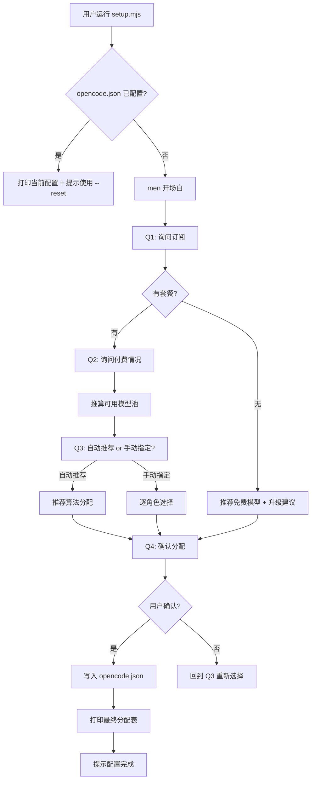

# 新用户引导式模型配置流程 — 设计文档

> 目标：新用户首次运行 `node scripts/setup.mjs` 后，通过和 men 的**对话式交互**完成模型配置，自动写入 `opencode.json`。
> 设计版本：v1.0
> 对应 SID：ultrawork-20260822-190626

---

## 目录

1. [对话流程设计](#1-对话流程设计)
2. [模型知识基结构](#2-模型知识基结构)
3. [推荐算法逻辑](#3-推荐算法逻辑)
4. [自动配置写入](#4-自动配置写入)
5. [脚本入口设计](#5-脚本入口设计)

---

## 1. 对话流程设计

### 1.1 整体流程（Mermaid）



### 1.2 开场白

**men 说：**

```
👋 你好！我是 **men（门）**，假维斯 Agent 团队的编排核心。

我看到你想手动配置模型（未使用 CC Switch 托管）。说明一下：这不是必选步骤——若模型已由 CC Switch 在本机托管，团队即可正常运行；仅当你希望本仓库的 opencode.json 自行管理模型分配时才需要继续。

我会问你几个简单的问题，帮你找到最适合你手上资源的模型组合。
整个过程大概 2-3 分钟，准备好了我们就开始。
```

**设计要点：**
- 体现 men 身份（编排者）
- 说明接下来要做什么（配置模型）
- 给出预期时间（2-3 分钟）
- 使用口语化、亲切的语气

### 1.3 提问清单

#### Q1：询问订阅

| 属性 | 值 |
|------|-----|
| **问题** | 你目前订阅了哪些 AI 服务的套餐？可以多选。如果你不太确定，也可以告诉我你大概了解哪些。 |
| **回答类型** | 多选（枚举），或自由文本 |
| **候选选项** | 1. OpenCode 套餐（`opencode-go`）<br>2. SenseNova（商汤）<br>3. 火山引擎（豆包）<br>4. DeepSeek 官方<br>5. 还没有任何套餐<br>6. 我不太确定 / 其他 |
| **分支逻辑** | • 选 1-4 → 标记用户的可用 provider 池，进入 Q2<br>• 选 5 → 跳转到[无套餐用户处理](#16-无套餐用户处理)<br>• 选 6 → 追问"方便具体说说你有什么资源吗？"或推荐默认方案 |

**对话示例：**

```
men > 你目前订阅了哪些 AI 服务的套餐？可以多选。

     1️⃣ OpenCode 套餐（opencode-go）
     2️⃣ SenseNova（商汤）
     3️⃣ 火山引擎（豆包 / 方舟）
     4️⃣ DeepSeek 官方
     5️⃣ 还没有任何套餐
     6️⃣ 我不太确定

     直接回复数字（如 1,3 表示选了 OpenCode + 火山引擎）。
```

---

#### Q2：付费情况

| 属性 | 值 |
|------|-----|
| **问题** | 你目前有付费套餐吗？还是在使用免费额度？ |
| **回答类型** | 单选（枚举） |
| **候选选项** | 1. 有付费套餐<br>2. 只用免费额度 |
| **分支逻辑** | • 有付费 → 可用模型池包含 premium 模型<br>• 免费额度 → 仍然可以使用 premium 模型（有限额），但推荐优先使用 free 模型<br>• 如果 Q1 选了 5（无套餐），此问题跳过 |

**对话示例：**

```
men > 了解！你选了 OpenCode 套餐 + 火山引擎。那目前是付费订阅还是免费额度？

     1️⃣ 付费订阅
     2️⃣ 免费额度/试用
```

---

#### Q3：推荐 or 手动指定

| 属性 | 值 |
|------|-----|
| **问题** | 你想为每个角色指定模型，还是让我来推荐最佳组合？ |
| **回答类型** | 单选（枚举） |
| **候选选项** | 1. 你来推荐（推荐）<br>2. 我自己指定 |
| **分支逻辑** | • 推荐 → 执行推荐算法，进入 Q4<br>• 自己指定 → 逐角色让用户选择 |

**对话示例（推荐路径）：**

```
men > 好，我来帮你推荐。以下是你可用的模型资源：

      可用模型：
      • 🔷 opencode-go/hy3（OpenCode 套餐，高级推理）
      • 🔷 opencode-go/deepseek-v4-flash（OpenCode 套餐，强力推理）
      • 🔷 opencode-go/claude-3.5-sonnet（OpenCode 套餐，写作专用）
      • 🔶 sensenova/sensenova-6.8-flash-lite（免费，轻量）

      我的推荐方案是：
      ┌──────────┬──────────────────────────────────┐
      │ men      │ opencode-go/hy3                   │
     │ si       │ opencode-go/deepseek-v4-flash     │
     │ ji       │ opencode-go/deepseek-v4-flash     │
     │ chi      │ opencode-go/deepseek-v4-flash     │
     │ yi       │ sensenova/sensenova-6.8-flash-lite│
     │ xun      │ sensenova/sensenova-6.8-flash-lite│
     └──────────┴──────────────────────────────────┘

     你觉得这个方案如何？(y/n)
```

**对话示例（手动指定路径）：**

如果用户选"自己指定"，逐角色询问：

```
men > 好的，我们来逐个角色配置。每个角色我会列出可用的模型供你选择。

     --- 角色 1/6：men（编排核心）---
     men 负责接收你的指令、路由任务、汇总结果。需要较强的推理能力。
     
     可选模型：
      1️⃣ opencode-go/hy3（推荐 | 高级推理）
     2️⃣ opencode-go/deepseek-v4-flash（强力推理）
     3️⃣ sensenova/sensenova-6.8-flash-lite（免费，轻量）
     
     请选择 (1-3)：
```

以此类推，6 个角色依次询问。每个角色都附带：
- 角色职责简述
- 推荐模型（标注"推荐"）
- 可选范围
- 每个模型的简要说明

---

#### Q4：确认分配

| 属性 | 值 |
|------|-----|
| **问题** | 确认分配结果 |
| **回答类型** | 确认（y/n），或修改 |
| **分支逻辑** | • 确认 → 写入 opencode.json<br>• 拒绝 → 回到 Q3 重新选择（或逐角色修改）<br>• 修改 → 允许用户指定某个角色换模型 |

**对话示例：**

```
men > 最终配置如下：

     ┌──────────┬──────────────────────────────────┬──────────┐
     │ 角色     │ 模型                             │ 来源     │
     ├──────────┼──────────────────────────────────┼──────────┤
      │ men      │ opencode-go/hy3                  │ OpenCode │
     │ si       │ opencode-go/deepseek-v4-flash    │ OpenCode │
     │ ji       │ opencode-go/deepseek-v4-flash    │ OpenCode │
     │ chi      │ sensenova/glm-5.2                │ SenseNova│
     │ yi       │ sensenova/sensenova-6.8-flash-lite│ SenseNova│
     │ xun      │ sensenova/sensenova-6.8-flash-lite│ SenseNova│
     └──────────┴──────────────────────────────────┴──────────┘

     确认写入 opencode.json？(y/n)
```

### 1.4 无套餐用户处理

当用户 Q1 选"还没有任何套餐"时，进入此分支：

**men 说：**

```
没问题，没有套餐也可以使用这个项目。以下是推荐给你的免费模型组合：

     ┌──────────┬──────────────────────────────────────────────┐
     │ 角色     │ 推荐模型                                     │
     ├──────────┼──────────────────────────────────────────────┤
     │ men      │ sensenova/sensenova-6.8-flash-lite（免费）    │
     │ si       │ sensenova/sensenova-6.8-flash-lite（免费）    │
     │ ji       │ sensenova/sensenova-6.8-flash-lite（免费）    │
     │ chi      │ sensenova/sensenova-6.8-flash-lite（免费）    │
     │ yi       │ sensenova/sensenova-6.8-flash-lite（免费）    │
     │ xun      │ sensenova/sensenova-6.8-flash-lite（免费）    │
     └──────────┴──────────────────────────────────────────────┘

     ⚠️ 注意：免费模型在复杂推理、长文写作、代码生成等任务上
     能力有限。如果你遇到以下场景，建议升级套餐：

     • 深度推理 → 推荐 OpenCode 套餐（约 ¥XX/月）
     • 代码生成 → 推荐火山引擎（有免费额度）
     • 高质量写作 → 推荐 SenseNova 或 DeepSeek

     🔗 注册链接：
     • OpenCode 套餐：https://opencode.ai/pricing
     • SenseNova 控制台：https://console.sensenova.cn
     • 火山引擎：https://console.volcengine.com
     • DeepSeek：https://platform.deepseek.com

     现在用这个免费组合开始吗？(y/n)
```

**免费模型限制说明：**

| 模型 | 限制 | 适用场景 |
|------|------|----------|
| `sensenova/sensenova-6.8-flash-lite` | 上下文较短，推理深度有限 | 搜索、设计、简单对话 |
| `opencode-go/free-model`（若有） | 有调用频率限制 | 轻量任务 |
| DeepSeek 免费接口 | 可能有并发限制 | 简单推理 |

### 1.5 对话流程的状态机

```
状态: START
  → 检测 opencode.json 是否已配置模型
    → 已配置 → 打印当前 + 提示 --reset
    → 未配置 → 进入 Q1

状态: Q1_SUBSCRIPTION
  → 询问订阅
  → 回答:
    → 有套餐 → 进入 Q2_PAYMENT
    → 无套餐 → 进入 FREE_RECOMMEND
    → 不确定 → 追问或默认推荐

状态: Q2_PAYMENT
  → 询问付费情况
  → 回答:
    → 付费 → 可用池 = premium + free
    → 免费额度 → 可用池 = premium(有限) + free
  → 进入 Q3_MODE

状态: Q3_MODE
  → 推荐 or 手动
  → 推荐 → 执行推荐算法，进入 Q4_CONFIRM
  → 手动 → 进入 MANUAL_PICK

状态: MANUAL_PICK
  → 逐角色选择（6 轮）
  → 每轮显示角色职责 + 可用模型列表
  → 完成后进入 Q4_CONFIRM

状态: FREE_RECOMMEND
  → 展示免费方案 + 升级建议
  → 进入 Q4_CONFIRM

状态: Q4_CONFIRM
  → 展示最终分配表
  → 确认 → 写入文件 → 进入 DONE
  → 拒绝 → 回到 Q3_MODE
  → 修改 → 进入 MANUAL_PICK（或逐角色修改）

状态: DONE
  → 打印完成信息
  → 提示使用 /ultrawork
```

---

## 2. 模型知识基结构

### 2.1 文件位置

`config/models.json`

### 2.2 数据结构

```json
{
  "$schema": "https://raw.githubusercontent.com/cgartlab/men/main/config/models.schema.json",
  "version": "1.0.0",
  "providers": {
    "opencode-go": {
      "name": "OpenCode 套餐",
      "description": "OpenCode 官方提供的模型套餐，覆盖多种主流模型",
      "homepage": "https://opencode.ai/pricing",
      "models": [
        {
          "id": "opencode-go/deepseek-v4-flash",
          "name": "DeepSeek V4 Flash",
          "tier": "premium",
          "description": "DeepSeek 最新推理模型，综合能力强，适合编排、写作、代码",
          "bestFor": ["men", "si", "ji", "chi"],
          "free": false,
          "registerUrl": "https://opencode.ai/pricing",
          "limits": null
        },
        {
          "id": "opencode-go/gpt-4o",
          "name": "GPT-4o",
          "tier": "premium",
          "description": "OpenAI 多模态模型，适合通用任务",
          "bestFor": ["men", "si", "chi"],
          "free": false,
          "registerUrl": "https://opencode.ai/pricing",
          "limits": null
        },
        {
          "id": "opencode-go/claude-3.5-sonnet",
          "name": "Claude 3.5 Sonnet",
          "tier": "premium",
          "description": "Anthropic 高质量写作模型，适合写作和推理",
          "bestFor": ["si", "men", "chi"],
          "free": false,
          "registerUrl": "https://opencode.ai/pricing",
          "limits": null
        }
      ]
    },
    "sensenova": {
      "name": "SenseNova（商汤）",
      "description": "商汤科技大模型平台，提供多种模型",
      "homepage": "https://console.sensenova.cn",
      "models": [
        {
          "id": "sensenova/deepseek-v4-flash",
          "name": "DeepSeek V4 Flash（SenseNova）",
          "tier": "premium",
          "description": "通过 SenseNova 接入的 DeepSeek V4 Flash，推理能力强",
          "bestFor": ["men", "si", "ji"],
          "free": false,
          "registerUrl": "https://console.sensenova.cn",
          "limits": null
        },
        {
          "id": "sensenova/glm-5.2",
          "name": "GLM-5.2",
          "tier": "premium",
          "description": "智谱最新模型，逻辑分析能力强，适合评审和独立判断",
          "bestFor": ["chi"],
          "free": false,
          "registerUrl": "https://console.sensenova.cn",
          "limits": null
        },
        {
          "id": "sensenova/sensenova-6.8-flash-lite",
          "name": "SenseNova 6.8 Flash Lite",
          "tier": "free",
          "description": "SenseNova 免费轻量模型，适合搜索、设计等轻量任务",
          "bestFor": ["xun", "yi"],
          "free": true,
          "registerUrl": "https://console.sensenova.cn",
          "limits": {
            "type": "rate_limit",
            "description": "免费额度，有一定调用频率限制"
          }
        }
      ]
    },
    "huoshan": {
      "name": "火山引擎（豆包/方舟）",
      "description": "字节跳动火山引擎大模型平台",
      "homepage": "https://console.volcengine.com",
       "models": [
         {
          "id": "huoshan/doubao-lite",
          "name": "豆包 Lite",
          "tier": "free",
          "description": "火山引擎免费轻量模型",
          "bestFor": ["xun", "yi"],
          "free": true,
          "registerUrl": "https://console.volcengine.com",
          "limits": {
            "type": "rate_limit",
            "description": "免费额度，每日有调用上限"
          }
        }
      ]
    },
    "deepseek": {
      "name": "DeepSeek 官方",
      "description": "DeepSeek 官方平台",
      "homepage": "https://platform.deepseek.com",
      "models": [
        {
          "id": "deepseek/deepseek-v4-flash",
          "name": "DeepSeek V4 Flash",
          "tier": "premium",
          "description": "DeepSeek 官方推理模型",
          "bestFor": ["men", "si", "ji"],
          "free": false,
          "registerUrl": "https://platform.deepseek.com",
          "limits": null
        }
      ]
    }
  },
  "roleDefaults": {
    "men": {
      "roleName": "编排核心（men）",
      "description": "接收用户指令、路由任务、汇总结果，需要强力推理和代码理解",
      "priority": [
        "opencode-go/hy3",
        "opencode-go/deepseek-v4-flash",
        "sensenova/deepseek-v4-flash",
        "deepseek/deepseek-v4-flash",
        "sensenova/sensenova-6.8-flash-lite"
      ],
      "fallback": "sensenova/sensenova-6.8-flash-lite"
    },
    "si": {
      "roleName": "规划与写作（si）",
      "description": "深度推理、任务拆解、文章写作，需要最强推理和写作能力",
      "priority": [
        "opencode-go/deepseek-v4-flash",
        "sensenova/deepseek-v4-flash",
        "deepseek/deepseek-v4-flash",
        "opencode-go/claude-3.5-sonnet",
        "sensenova/sensenova-6.8-flash-lite"
      ],
      "fallback": "sensenova/sensenova-6.8-flash-lite"
    },
    "ji": {
      "roleName": "代码与工程（ji）",
      "description": "代码实现、前端开发、Git 操作，需要强代码能力",
      "priority": [
        "opencode-go/deepseek-v4-flash",
        "opencode-go/claude-3.5-sonnet",
        "sensenova/deepseek-v4-flash",
        "deepseek/deepseek-v4-flash",
        "sensenova/sensenova-6.8-flash-lite"
      ],
      "fallback": "sensenova/sensenova-6.8-flash-lite"
    },
    "chi": {
      "roleName": "投资分析与评审（chi）",
      "description": "独立评审其他 agent 产物，需要客观、逻辑分析能力",
      "priority": [
        "sensenova/glm-5.2",
        "opencode-go/deepseek-v4-flash",
        "opencode-go/claude-3.5-sonnet",
        "sensenova/sensenova-6.8-flash-lite"
      ],
      "fallback": "sensenova/sensenova-6.8-flash-lite"
    },
    "yi": {
      "roleName": "视觉与设计（yi）",
      "description": "设计决策、Token 定义、生图，偏向轻量推理",
      "priority": [
        "sensenova/sensenova-6.8-flash-lite",
        "huoshan/doubao-lite",
        "opencode-go/deepseek-v4-flash"
      ],
      "fallback": "sensenova/sensenova-6.8-flash-lite"
    },
    "xun": {
      "roleName": "研究助理（xun）",
      "description": "搜索、事实核查、RSS 聚合，偏向轻量推理",
      "priority": [
        "sensenova/sensenova-6.8-flash-lite",
        "huoshan/doubao-lite",
        "opencode-go/deepseek-v4-flash"
      ],
      "fallback": "sensenova/sensenova-6.8-flash-lite"
    }
  },
  "presets": {
    "default": {
      "name": "全功能推荐",
      "description": "使用用户所有可用模型的最佳组合",
      "men": "opencode-go/hy3",
      "si": "opencode-go/deepseek-v4-flash",
      "ji": "opencode-go/deepseek-v4-flash",
      "chi": "sensenova/glm-5.2",
      "yi": "sensenova/sensenova-6.8-flash-lite",
      "xun": "sensenova/sensenova-6.8-flash-lite"
    },
    "free": {
      "name": "全免费方案",
      "description": "全部使用免费模型，能力有限但有基础可用",
      "men": "sensenova/sensenova-6.8-flash-lite",
      "si": "sensenova/sensenova-6.8-flash-lite",
      "ji": "sensenova/sensenova-6.8-flash-lite",
      "chi": "sensenova/sensenova-6.8-flash-lite",
      "yi": "sensenova/sensenova-6.8-flash-lite",
      "xun": "sensenova/sensenova-6.8-flash-lite"
    }
  }
}
```

### 2.3 附加字段说明

| 字段 | 说明 |
|------|------|
| `tier` | `premium` = 需要付费订阅；`free` = 免费可用 |
| `bestFor` | 该模型最适合的角色列表（角色名） |
| `free` | 是否完全免费（无需任何付费） |
| `registerUrl` | 注册/订阅链接 |
| `limits` | 免费模型的限制说明（null 表示无额外限制） |
| `fallback` | 该角色无法匹配任何 premium 模型时的兜底模型 |

---

## 3. 推荐算法逻辑

### 3.1 算法伪代码

```
输入:
  subscriptions: Set<string>  // 用户订阅的 provider 列表
  hasPaid: boolean            // 是否有付费套餐
  availableModels: Model[]    // 从 config/models.json 读取

输出:
  assignment: { role: modelId }

算法:

// Step 1: 根据订阅过滤可用模型
function filterModels(subscriptions, hasPaid):
  candidates = []
  for each provider in subscriptions:
    candidates += models from provider
  if not hasPaid:
    // 无付费 → 只保留 free 模型 + 标记 premium 为"可用但有限额"
    candidates = candidates.filter(m => m.free || m.tier === 'premium')
  return candidates

// Step 2: 为每个角色推荐最佳模型
function recommend(role, candidates, roleDefaults):
  // 先找 bestFor 包含该角色的 premium 模型
  best = candidates.find(m =>
    m.bestFor.includes(role) && m.tier === 'premium'
  )
  if best: return best.id

  // 再找 bestFor 包含该角色的 free 模型
  best = candidates.find(m =>
    m.bestFor.includes(role) && m.free === true
  )
  if best: return best.id

  // 按 roleDefaults.priority 顺序匹配
  for each modelId in roleDefaults[role].priority:
    if candidates.some(m => m.id === modelId):
      return modelId

  // 兜底：使用角色的 fallback
  return roleDefaults[role].fallback

// Step 3: 生成完整分配
function generateAssignment(subscriptions, hasPaid):
  models = loadModels()
  candidates = filterModels(subscriptions, hasPaid)
  assignment = {}
  for each role in ['men', 'si', 'ji', 'chi', 'yi', 'xun']:
    assignment[role] = recommend(role, candidates, models.roleDefaults)
  return assignment
```

### 3.2 决策表

| 场景 | 订阅 | 付费 | men | si | ji | chi | yi | xun |
|------|------|------|-----|-----|-----|-----|-----|-----|
| 全套餐 | opencode-go + sensenova + huoshan | ✅ | opencode-go/hy3 | opencode-go/deepseek-v4-flash | opencode-go/deepseek-v4-flash | sensenova/glm-5.2 | sensenova/sensenova-6.8-flash-lite | sensenova/sensenova-6.8-flash-lite |
| 仅 opencode-go | opencode-go | ✅ | opencode-go/deepseek-v4-flash | opencode-go/deepseek-v4-flash | opencode-go/deepseek-v4-flash | opencode-go/deepseek-v4-flash | opencode-go/deepseek-v4-flash | opencode-go/deepseek-v4-flash |
| 仅 sensenova | sensenova | ✅ | sensenova/deepseek-v4-flash | sensenova/deepseek-v4-flash | sensenova/deepseek-v4-flash | sensenova/glm-5.2 | sensenova/sensenova-6.8-flash-lite | sensenova/sensenova-6.8-flash-lite |
| 无套餐 | ∅ | ❌ | sensenova/sensenova-6.8-flash-lite | sensenova/sensenova-6.8-flash-lite | sensenova/sensenova-6.8-flash-lite | sensenova/sensenova-6.8-flash-lite | sensenova/sensenova-6.8-flash-lite | sensenova/sensenova-6.8-flash-lite |
| 混合 A | opencode-go + sensenova | ✅ | opencode-go/deepseek-v4-flash | opencode-go/deepseek-v4-flash | opencode-go/deepseek-v4-flash | sensenova/glm-5.2 | sensenova/sensenova-6.8-flash-lite | sensenova/sensenova-6.8-flash-lite |

### 3.3 推荐优先级规则

```
规则 1 — 最优匹配优先
  如果一个 premium 模型的 bestFor 包含目标角色，优先使用它

规则 2 — 角色特异性优先
  chi 角色优先匹配 GLM-5.2（其 bestFor 唯一包含 chi）
  这比通用推理模型更优

规则 3 — 免费兜底
  如果用户无 premium 模型可用，使用 free 模型
  如果 free 模型也不够，使用角色的 fallback

规则 4 — 避免重复分配
  如果某个 premium 模型是"稀缺资源"（如只有特定 provider 有），
  优先分配给其 bestFor 中排第一的角色

规则 5 — 一致性优先
  对于轻量角色（xun, yi），优先使用 free 模型
  即使有 premium 可用，也推荐 free（节省配额）
```

---

## 4. 自动配置写入

### 4.1 写入流程

```
用户确认 (y)
  → 备份当前 opencode.json → opencode.json.bak
  → 读取 opencode.json
  → 更新 agent 字段为分配结果
  → 写入 opencode.json
  → 验证写入结果（读取文件确认）
  → 打印最终分配表
  → 提示完成
```

### 4.2 写入内容

仅修改 `opencode.json` 中的 `agent` 字段，其他字段保持不变：

```json
{
  "agent": {
    "men": { "model": "opencode-go/hy3" },
    "si": { "model": "opencode-go/deepseek-v4-flash" },
    "ji": { "model": "opencode-go/deepseek-v4-flash" },
    "chi": { "model": "sensenova/glm-5.2" },
    "yi": { "model": "sensenova/sensenova-6.8-flash-lite" },
    "xun": { "model": "sensenova/sensenova-6.8-flash-lite" }
  }
}
```

### 4.3 写入前显示

写入前打印分配表，格式：

```
📋 最终分配方案
━━━━━━━━━━━━━━━━━━━━━━━━━━━━━━━━━━━━━━━━━━━━━━━━━━━━━━━━━━━━━━━━
  角色       模型                          Provider      费用
━━━━━━━━━━━━━━━━━━━━━━━━━━━━━━━━━━━━━━━━━━━━━━━━━━━━━━━━━━━━━━━━
  men        opencode-go/hy3                OpenCode     付费
  si         opencode-go/deepseek-v4-flash OpenCode 套餐 付费
  ji         opencode-go/deepseek-v4-flash OpenCode 套餐 付费
  chi        sensenova/glm-5.2             SenseNova     付费
  yi         sensenova/sensenova-6.8-flash-lite  SenseNova 免费
  xun        sensenova/sensenova-6.8-flash-lite  SenseNova 免费
━━━━━━━━━━━━━━━━━━━━━━━━━━━━━━━━━━━━━━━━━━━━━━━━━━━━━━━━━━━━━━━━
  付费模型: 4  |  免费模型: 2  |  总费用估算: ¥XX/月
━━━━━━━━━━━━━━━━━━━━━━━━━━━━━━━━━━━━━━━━━━━━━━━━━━━━━━━━━━━━━━━━

确认写入 opencode.json？(y/n)
```

### 4.4 写入后提示

```
✅ 配置完成！已写入 opencode.json

  原文件已备份为 opencode.json.bak（如需恢复）

  你现在可以：
  • 重启 OpenCode 加载新配置
  • 运行 /ultrawork 开始使用假维斯团队
  • 运行 node scripts/setup.mjs --reset 重新配置
```

### 4.5 错误处理

| 情况 | 行为 |
|------|------|
| `opencode.json` 不存在 | 报错退出，提示项目结构问题 |
| 写入权限不足 | 报错，提示用管理员权限或检查文件权限 |
| JSON 格式错误 | 打印错误位置，提示手动修复 |
| 备份失败 | 警告但不中断，继续写入 |
| 写入后验证失败 | 回滚备份，提示用户手动检查 |

---

## 5. 脚本入口设计

### 5.1 脚本文件

`scripts/setup.mjs`

### 5.2 命令行接口

```
Usage:
  node scripts/setup.mjs              # 交互式配置（默认）
  node scripts/setup.mjs --help       # 显示帮助
  node scripts/setup.mjs --reset      # 强制重新配置（忽略已有配置）
  node scripts/setup.mjs --json       # JSON 输出模式（供 CI/自动化使用）
  node scripts/setup.mjs --preset <name>  # 使用预设跳过交互

Options:
  --help         显示帮助信息
  --reset        强制重新配置（忽略已有的 opencode.json 配置）
  --json         以 JSON 格式输出结果（供自动化脚本消费）
  --preset <name> 使用预设方案（default | free），跳过交互
  --dry-run      模拟运行，不写入文件
  --verbose      打印详细调试信息
```

### 5.3 行为逻辑

```
function main():
  args = parseArgs()

  if args.help: showHelp(); return

  if args.preset:
    assignment = loadPreset(args.preset)
    if args.dryRun:
      printAssignment(assignment)
      print("[DRY RUN] 未写入文件")
      return
    writeToOpencodeJson(assignment)
    printAssignment(assignment)
    print("✅ 预设方案已应用")
    return

  config = readOpencodeJson()

  if config.agent and config.agent.men?.model:
    if args.reset:
      print("检测到已有配置，--reset 强制重新配置")
    else:
      print("当前 opencode.json 已配置模型:")
      printCurrentConfig(config.agent)
      print("如需重新配置，请使用 --reset 参数")
      return

  // 进入交互模式
  if args.json:
    // JSON 模式：非交互，使用默认推荐
    assignment = recommendDefault()
    print(JSON.stringify(assignment, null, 2))
    if not args.dryRun:
      writeToOpencodeJson(assignment)
    return

  // 交互模式
  subscriptions = askQ1()       // 询问订阅
  if subscriptions.isEmpty():
    handleFreeUser()            // 无套餐用户处理
  else:
    hasPaid = askQ2()           // 询问付费
    mode = askQ3()              // 推荐 or 手动
    if mode === 'auto':
      assignment = recommend(subscriptions, hasPaid)
    else:
      assignment = manualPick(subscriptions, hasPaid)
    confirmAndWrite(assignment)  // Q4: 确认 + 写入
```

### 5.4 预设方案

| 预设名 | 说明 | 适用场景 |
|--------|------|----------|
| `default` | 全功能推荐，使用用户所有可用模型的组合 | 已配置多 provider 的用户 |
| `free` | 全免费方案，全部使用 `sensenova-6.8-flash-lite` | 无套餐新用户，或 CI 环境 |

### 5.5 JSON 输出格式

`--json` 模式下，输出：

```json
{
  "ok": true,
  "mode": "interactive",
  "assignment": {
    "men": "opencode-go/hy3",
    "si": "opencode-go/deepseek-v4-flash",
    "ji": "opencode-go/deepseek-v4-flash",
    "chi": "sensenova/glm-5.2",
    "yi": "sensenova/sensenova-6.8-flash-lite",
    "xun": "sensenova/sensenova-6.8-flash-lite"
  },
  "stats": {
    "premiumCount": 4,
    "freeCount": 2,
    "providersUsed": ["opencode-go", "sensenova", "huoshan"]
  },
  "warnings": [
    "免费模型在复杂推理任务上能力有限"
  ],
  "fileWritten": "opencode.json"
}
```

### 5.6 依赖

| 依赖 | 用途 | 类型 |
|------|------|------|
| Node.js >= 18 | 运行环境 | 运行时 |
| 内置 `fs` | 文件读写 | 内置 |
| 内置 `readline` | 交互式输入 | 内置 |
| 内置 `path` | 路径处理 | 内置 |
| 内置 `process` | 参数解析、退出 | 内置 |

**零外部依赖** — 只使用 Node.js 内置模块。

### 5.7 文件操作清单

| 操作 | 文件 | 说明 |
|------|------|------|
| 读取 | `opencode.json` | 读取当前配置 |
| 备份 | `opencode.json.bak` | 写入前备份 |
| 写入 | `opencode.json` | 写入新配置 |
| 读取 | `config/models.json` | 读取模型知识基 |
| 验证 | `opencode.json` | 写入后读取验证 |

---

## 总结

| 章节 | 内容 | 状态 |
|------|------|------|
| 1. 对话流程设计 | 包含开场白、Q1-Q4 提问清单、无套餐处理、状态机 | ✅ |
| 2. 模型知识基结构 | `config/models.json` 完整数据结构，含 4 个 provider 和 6 个角色默认 | ✅ |
| 3. 推荐算法逻辑 | 伪代码 + 决策表 + 5 条优先级规则 | ✅ |
| 4. 自动配置写入 | 写入流程、内容、显示格式、错误处理 | ✅ |
| 5. 脚本入口设计 | CLI 接口、行为逻辑、预设、JSON 输出、依赖 | ✅ |

**产出文件：** `docs/guide/onboarding-design.md`