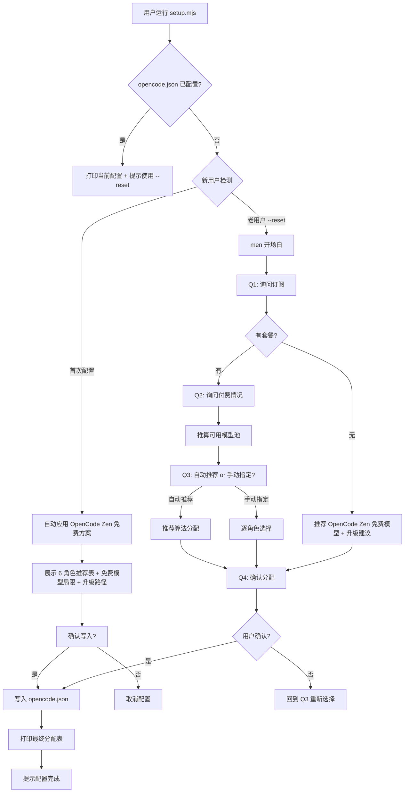

# 新用户引导式模型配置流程 — 设计文档

> 目标：新用户首次运行 `node scripts/setup.mjs` 后，通过和 men 的**对话式交互**完成模型配置，自动写入 `opencode.json`，并可创建全局 `~/.config/opencode/men.jsonc` 跨项目统一管理模型预设。
> 设计版本：v2.0
> 对应 SID：ultrawork-20260822-190626

---

## 目录

1. [对话流程设计](#1-对话流程设计)
2. [模型知识基结构](#2-模型知识基结构)
3. [推荐算法逻辑](#3-推荐算法逻辑)
4. [自动配置写入](#4-自动配置写入)
5. [脚本入口设计](#5-脚本入口设计)
6. [全局配置文件（men.jsonc）](#6-全局配置文件menjsonc)
7. [配置解析优先级](#7-配置解析优先级)
8. [预设切换](#8-预设切换)
9. [使用示例](#9-使用示例)

---

## 1. 对话流程设计

### 1.1 整体流程（Mermaid）



### 1.2 新用户检测

**触发条件：** `main()` 中 `configured = isConfigured(config)` 为 `false`（`opencode.json` 中 6 个角色均无 `model` 字段）。

**行为：** 检测为新用户后，**直接进入新用户免费路径**，不再走 Q1-Q4 问答流程。

```js
// scripts/setup.mjs
function isConfigured(config) {
  if (!config.agent) return false;
  return ROLES.every((r) => config.agent[r]?.model);
}
```

---

### 1.3 新用户免费路径

当用户首次配置（未检测到已有 agent 配置）时，`handleNewUser()` 自动应用 `models.presets.free`（OpenCode Zen 全免费方案）。

**流程：**
1. 展示欢迎语，说明"检测到您是首次配置，将自动应用 OpenCode Zen 免费模型方案"
2. 展示 6 个角色的推荐模型表格
3. 展示免费模型的局限（限免期间、可能随时变动）
4. 展示后续升级到付费模型的选项（1=OpenCode Zen 订阅, 2=其他 provider 注册）
5. 确认写入（y/n），确认后返回 `models.presets.free` 作为 assignment

**men 说（新用户）：**

```
men > 👋 你好！我是 **men（门）**，Men Agent 团队的编排核心。

men > 检测到您是首次配置，将自动应用 **OpenCode Zen 免费模型**方案。
men > OpenCode Zen 是 OpenCode 官方模型网关，无需订阅即可使用免费模型，适合新用户快速上手。

men > 以下是 6 个角色的推荐模型：
     ┌──────┬──────────────────────────────────────────┬─────────────────────────────────┬──────┐
     │ 角色 │ 模型                                     │ Provider                        │ 费用 │
     ├──────┼──────────────────────────────────────────┼─────────────────────────────────┼──────┤
     │ men  │ opencode-zen/hy3-free                    │ OpenCode Zen（免费 + 按量付费） │ 免费 │
     │ si   │ opencode-zen/deepseek-v4-flash-free      │ OpenCode Zen（免费 + 按量付费） │ 免费 │
     │ ji   │ opencode-zen/north-mini-code-free        │ OpenCode Zen（免费 + 按量付费） │ 免费 │
     │ chi  │ opencode-zen/mimo-v2.5-free              │ OpenCode Zen（免费 + 按量付费） │ 免费 │
     │ yi   │ opencode-zen/nemotron-3-ultra-free       │ OpenCode Zen（免费 + 按量付费） │ 免费 │
     │ xun  │ opencode-zen/nemotron-3.5-lightning-free │ OpenCode Zen（免费 + 按量付费） │ 免费 │
     └──────┴──────────────────────────────────────────┴─────────────────────────────────┴──────┘

men > ⚠️ 免费模型限制说明：
     • OpenCode Zen 免费模型在限免期间提供，可能随时变动
     • 免费模型在复杂推理、长文写作、代码生成等任务上能力有限

men > 后续如需升级到付费模型，可选择：
     1️⃣ OpenCode Zen 订阅（按量付费，https://opencode.ai/zen）
     2️⃣ 其他 provider 注册（SenseNova / 火山引擎 / DeepSeek）
        届时可运行 node scripts/setup.mjs --reset 重新配置。

确认使用此免费方案写入 opencode.json？(y/n)
```

**设计要点：**
- 新用户零门槛：不询问订阅/付费情况，直接给出可用的免费方案
- 保留升级路径提示：用户之后可用 `--reset` 重新配置
- `presets.free` 全部指向 `opencode-zen/*-free` 模型，作为新用户默认

---

### 1.4 开场白（老用户 --reset 流程）

**men 说：**

```
👋 你好！我是 **men（门）**，Men Agent 团队的编排核心。

我们重新配置模型分配，让 Men Agent 团队以最合适的模型组合运行。

我会问你几个简单的问题，帮你找到最适合你手上资源的模型组合。
整个过程大概 2-3 分钟，准备好了我们就开始。
```

**设计要点：**
- 体现 men 身份（编排者）
- 说明接下来要做什么（配置模型）
- 给出预期时间（2-3 分钟）
- 使用口语化、亲切的语气

### 1.5 提问清单

#### Q1：询问订阅

| 属性 | 值 |
|------|-----|
| **问题** | 你目前订阅了哪些 AI 服务的套餐？可以多选。如果你不太确定，也可以告诉我你大概了解哪些。 |
| **回答类型** | 多选（枚举），或自由文本 |
| **候选选项** | 1. OpenCode Zen（免费+按量付费，`opencode-zen`）<br>2. SenseNova（商汤）<br>3. 火山引擎（豆包）<br>4. DeepSeek 官方<br>5. 还没有任何套餐<br>6. 我不太确定 / 其他 |
| **分支逻辑** | • 选 1-4 → 标记用户的可用 provider 池，进入 Q2<br>• 选 5 → 跳转到[无套餐用户处理](#16-无套餐用户处理)<br>• 选 6 → 追问"方便具体说说你有什么资源吗？"或推荐默认方案 |

**对话示例：**

```
men > 你目前订阅了哪些 AI 服务的套餐？可以多选。

     1️⃣ OpenCode Zen（免费+按量付费）
     2️⃣ SenseNova（商汤）
     3️⃣ 火山引擎（豆包 / 方舟）
     4️⃣ DeepSeek 官方
     5️⃣ 还没有任何套餐
     6️⃣ 我不太确定

     直接回复数字（如 1,3 表示选了 OpenCode Zen + 火山引擎）。
```

---

#### Q2：付费情况

| 属性 | 值 |
|------|-----|
| **问题** | 你目前有付费套餐吗？还是在使用免费额度？ |
| **回答类型** | 单选（枚举） |
| **候选选项** | 1. 有付费套餐<br>2. 只用免费额度 |
| **分支逻辑** | • 有付费 → 可用模型池包含 premium 模型<br>• 免费额度 → 仍然可以使用 premium 模型（有限额），但推荐优先使用 free 模型<br>• 如果 Q1 选了 5（无套餐），此问题跳过 |

**对话示例：**

```
men > 了解！你选了 OpenCode Zen + 火山引擎。那目前是付费订阅还是免费额度？

     1️⃣ 付费订阅
     2️⃣ 免费额度/试用
```

---

#### Q3：推荐 or 手动指定

| 属性 | 值 |
|------|-----|
| **问题** | 你想为每个角色指定模型，还是让我来推荐最佳组合？ |
| **回答类型** | 单选（枚举） |
| **候选选项** | 1. 你来推荐（推荐）<br>2. 我自己指定 |
| **分支逻辑** | • 推荐 → 执行推荐算法，进入 Q4<br>• 自己指定 → 逐角色让用户选择 |

**对话示例（推荐路径）：**

```
men > 好，我来帮你推荐。以下是你可用的模型资源：

      可用模型：
      • 🔶 opencode-zen/hy3-free（OpenCode Zen，免费，高级推理）
      • 🔶 opencode-zen/deepseek-v4-flash-free（OpenCode Zen，免费，强力推理）
      • 🔶 opencode-zen/north-mini-code-free（OpenCode Zen，免费，代码专用）
      • 🔶 sensenova/sensenova-6.8-flash-lite（免费，轻量）

      我的推荐方案是：
      ┌──────────┬──────────────────────────────────┐
      │ men      │ opencode-zen/hy3-free            │
      │ si       │ opencode-zen/deepseek-v4-flash-free │
      │ ji       │ opencode-zen/north-mini-code-free │
      │ chi      │ opencode-zen/mimo-v2.5-free      │
      │ yi       │ opencode-zen/nemotron-3-ultra-free │
      │ xun      │ opencode-zen/nemotron-3.5-lightning-free │
      └──────────┴──────────────────────────────────┘

      你觉得这个方案如何？(y/n)
```

**对话示例（手动指定路径）：**

如果用户选"自己指定"，逐角色询问：

```
men > 好的，我们来逐个角色配置。每个角色我会列出可用的模型供你选择。

     --- 角色 1/6：men（编排核心）---
     men 负责接收你的指令、路由任务、汇总结果。需要较强的推理能力。
     
     可选模型：
      1️⃣ opencode-zen/hy3-free（推荐 | 高级推理）
     2️⃣ opencode-zen/deepseek-v4-flash-free（强力推理）
     3️⃣ sensenova/sensenova-6.8-flash-lite（免费，轻量）
     
     请选择 (1-3)：
```

以此类推，6 个角色依次询问。每个角色都附带：
- 角色职责简述
- 推荐模型（标注"推荐"）
- 可选范围
- 每个模型的简要说明

---

#### Q4：确认分配

| 属性 | 值 |
|------|-----|
| **问题** | 确认分配结果 |
| **回答类型** | 确认（y/n），或修改 |
| **分支逻辑** | • 确认 → 写入 opencode.json<br>• 拒绝 → 回到 Q3 重新选择（或逐角色修改）<br>• 修改 → 允许用户指定某个角色换模型 |

**对话示例：**

```
men > 最终配置如下：

     ┌──────────┬──────────────────────────────────┬──────────┐
     │ 角色     │ 模型                             │ 来源     │
     ├──────────┼──────────────────────────────────┼──────────┤
      │ men      │ opencode-go/hy3                  │ OpenCode │
     │ si       │ opencode-go/deepseek-v4-flash    │ OpenCode │
     │ ji       │ opencode-go/deepseek-v4-flash    │ OpenCode │
     │ chi      │ sensenova/glm-5.2                │ SenseNova│
     │ yi       │ sensenova/sensenova-6.8-flash-lite│ SenseNova│
     │ xun      │ sensenova/sensenova-6.8-flash-lite│ SenseNova│
     └──────────┴──────────────────────────────────┴──────────┘

     确认写入 opencode.json？(y/n)
```

### 1.6 无套餐用户处理

当老用户（--reset）Q1 选 5（还没有任何套餐）或 6（不太确定）时，进入此分支（`handleFreeUser()` 兜底路径），推荐 OpenCode Zen 免费方案：

**men 说：**

```
没问题，没有套餐也可以使用这个项目。以下是推荐给你的免费模型组合：

     ┌──────────┬──────────────────────────────────────────┐
     │ 角色     │ 推荐模型                                 │
     ├──────────┼──────────────────────────────────────────┤
     │ men      │ opencode-zen/hy3-free                    │
     │ si       │ opencode-zen/deepseek-v4-flash-free      │
     │ ji       │ opencode-zen/north-mini-code-free        │
     │ chi      │ opencode-zen/mimo-v2.5-free              │
     │ yi       │ opencode-zen/nemotron-3-ultra-free       │
     │ xun      │ opencode-zen/nemotron-3.5-lightning-free │
     └──────────┴──────────────────────────────────────────┘

     ⚠️ 注意：免费模型在复杂推理、长文写作、代码生成等任务上
     能力有限，且 OpenCode Zen 免费模型为限免期间提供、可能随时变动。
     如果你遇到以下场景，建议升级到按量付费：

     • 深度推理 / 代码生成 → 推荐 OpenCode Zen 订阅（按量计费）
     • 高质量写作 → 推荐 SenseNova 或 DeepSeek

     🔗 注册链接：
     • OpenCode Zen：https://opencode.ai/zen
     • SenseNova 控制台：https://console.sensenova.cn
     • 火山引擎：https://console.volcengine.com
     • DeepSeek：https://platform.deepseek.com

     现在用这个免费组合开始吗？(y/n)
```

**免费模型限制说明：**

| 模型 | 限制 | 适用场景 |
|------|------|----------|
| `opencode-zen/*-free` | 限免期间提供，可能随时变动 | 搜索、设计、编排、轻量推理 |
| `sensenova/sensenova-6.8-flash-lite` | 上下文较短，推理深度有限 | 搜索、设计、简单对话 |
| `huoshan/doubao-lite` | 免费额度，每日有调用上限 | 轻量任务 |

### 1.7 对话流程的状态机

```
状态: START
  → 检测 opencode.json 是否已配置模型
    → 已配置 → 打印当前 + 提示 --reset
    → 未配置 → 进入 NEW_USER

状态: NEW_USER（新用户免费路径）
  → 自动应用 OpenCode Zen 免费方案（presets.free）
  → 展示 6 角色推荐表 + 免费模型局限 + 升级路径
  → 确认写入 → 进入 DONE
  → 拒绝 → 取消配置

状态: Q1_SUBSCRIPTION（老用户 --reset）
  → 询问订阅
  → 回答:
    → 有套餐 → 进入 Q2_PAYMENT
    → 无套餐 → 进入 FREE_RECOMMEND
    → 不确定 → 追问或默认推荐

状态: Q2_PAYMENT
  → 询问付费情况
  → 回答:
    → 付费 → 可用池 = premium + free
    → 免费额度 → 可用池 = premium(有限) + free
  → 进入 Q3_MODE

状态: Q3_MODE
  → 推荐 or 手动
  → 推荐 → 执行推荐算法，进入 Q4_CONFIRM
  → 手动 → 进入 MANUAL_PICK

状态: MANUAL_PICK
  → 逐角色选择（6 轮）
  → 每轮显示角色职责 + 可用模型列表
  → 完成后进入 Q4_CONFIRM

状态: FREE_RECOMMEND
  → 展示免费方案 + 升级建议
  → 进入 Q4_CONFIRM

状态: Q4_CONFIRM
  → 展示最终分配表
  → 确认 → 写入文件 → 进入 DONE
  → 拒绝 → 回到 Q3_MODE
  → 修改 → 进入 MANUAL_PICK（或逐角色修改）

状态: DONE
  → 打印完成信息
  → 提示使用 /ultrawork
```

---

## 2. 模型知识基结构

### 2.1 文件位置

`config/models.json`

### 2.2 数据结构

```json
{
  "$schema": "https://raw.githubusercontent.com/cgartlab/men/main/config/models.schema.json",
  "version": "1.0.0",
  "providers": {
    "opencode-zen": {
      "name": "OpenCode Zen（免费 + 按量付费）",
      "description": "OpenCode 官方模型网关：旋转免费模型 + 付费模型按量计费。无需订阅，适合新用户。",
      "homepage": "https://opencode.ai/zen",
      "registerUrl": "https://opencode.ai/zen",
      "models": [
        {
          "id": "opencode-zen/deepseek-v4-flash-free",
          "name": "DeepSeek V4 Flash Free",
          "tier": "free",
          "description": "OpenCode Zen 免费 DeepSeek V4 Flash，旋转免费模型，适合编排、写作、代码",
          "bestFor": ["men", "si", "ji", "chi"],
          "free": true,
          "registerUrl": "https://opencode.ai/zen",
          "limits": {
            "type": "rotating_free",
            "description": "限免期间免费，模型可能随时变动"
          }
        },
        {
          "id": "opencode-zen/hy3-free",
          "name": "Hy3 Free",
          "tier": "free",
          "description": "OpenCode Zen 免费 Hy3，高级推理，适合编排和复杂推理",
          "bestFor": ["men", "si", "ji"],
          "free": true,
          "registerUrl": "https://opencode.ai/zen",
          "limits": {
            "type": "rotating_free",
            "description": "限免期间免费，模型可能随时变动"
          }
        },
        {
          "id": "opencode-zen/mimo-v2.5-free",
          "name": "MiMo-V2.5 Free",
          "tier": "free",
          "description": "OpenCode Zen 免费 MiMo-V2.5，综合能力均衡，适合编排、评审",
          "bestFor": ["men", "si", "ji", "chi"],
          "free": true,
          "registerUrl": "https://opencode.ai/zen",
          "limits": {
            "type": "rotating_free",
            "description": "限免期间免费，模型可能随时变动"
          }
        },
        {
          "id": "opencode-zen/big-pickle",
          "name": "Big Pickle",
          "tier": "free",
          "description": "OpenCode Zen 免费 Big Pickle，通用任务模型，适合所有角色",
          "bestFor": ["men", "si", "ji", "chi", "yi", "xun"],
          "free": true,
          "registerUrl": "https://opencode.ai/zen",
          "limits": {
            "type": "rotating_free",
            "description": "限免期间免费，模型可能随时变动"
          }
        },
        {
          "id": "opencode-zen/north-mini-code-free",
          "name": "North Mini Code Free",
          "tier": "free",
          "description": "OpenCode Zen 免费代码模型，专注代码生成与工程任务",
          "bestFor": ["ji", "si"],
          "free": true,
          "registerUrl": "https://opencode.ai/zen",
          "limits": {
            "type": "rotating_free",
            "description": "限免期间免费，模型可能随时变动"
          }
        },
        {
          "id": "opencode-zen/nemotron-3-ultra-free",
          "name": "Nemotron 3 Ultra Free",
          "tier": "free",
          "description": "OpenCode Zen 免费 Nemotron 3 Ultra，适合搜索、研究、设计",
          "bestFor": ["xun", "yi"],
          "free": true,
          "registerUrl": "https://opencode.ai/zen",
          "limits": {
            "type": "rotating_free",
            "description": "限免期间免费，模型可能随时变动"
          }
        },
        {
          "id": "opencode-zen/nemotron-3.5-lightning-free",
          "name": "Nemotron 3.5 Lightning Free",
          "tier": "free",
          "description": "OpenCode Zen 免费 Nemotron 3.5 Lightning，轻量快速，适合研究、设计",
          "bestFor": ["xun", "yi"],
          "free": true,
          "registerUrl": "https://opencode.ai/zen",
          "limits": {
            "type": "rotating_free",
            "description": "限免期间免费，模型可能随时变动"
          }
        },
        {
          "id": "opencode-zen/muse-spark-1.2-contributor-free",
          "name": "Muse Spark 1.2 Free",
          "tier": "free",
          "description": "OpenCode Zen 免费 Muse Spark 1.2，创意与设计辅助，适合研究、设计",
          "bestFor": ["xun", "yi"],
          "free": true,
          "registerUrl": "https://opencode.ai/zen",
          "limits": {
            "type": "rotating_free",
            "description": "限免期间免费，模型可能随时变动"
          }
        }
      ]
    },
    "opencode-go": {
      "name": "OpenCode 套餐",
      "description": "OpenCode 官方提供的模型套餐，覆盖多种主流模型",
      "homepage": "https://opencode.ai/pricing",
      "models": [
        {
          "id": "opencode-go/deepseek-v4-flash",
          "name": "DeepSeek V4 Flash",
          "tier": "premium",
          "description": "DeepSeek 最新推理模型，综合能力强，适合编排、写作、代码",
          "bestFor": ["men", "si", "ji", "chi"],
          "free": false,
          "registerUrl": "https://opencode.ai/pricing",
          "limits": null
        },
        {
          "id": "opencode-go/gpt-4o",
          "name": "GPT-4o",
          "tier": "premium",
          "description": "OpenAI 多模态模型，适合通用任务",
          "bestFor": ["men", "si", "chi"],
          "free": false,
          "registerUrl": "https://opencode.ai/pricing",
          "limits": null
        },
        {
          "id": "opencode-go/claude-3.5-sonnet",
          "name": "Claude 3.5 Sonnet",
          "tier": "premium",
          "description": "Anthropic 高质量写作模型，适合写作和推理",
          "bestFor": ["si", "men", "chi"],
          "free": false,
          "registerUrl": "https://opencode.ai/pricing",
          "limits": null
        }
      ]
    },
    "sensenova": {
      "name": "SenseNova（商汤）",
      "description": "商汤科技大模型平台，提供多种模型",
      "homepage": "https://console.sensenova.cn",
      "models": [
        {
          "id": "sensenova/deepseek-v4-flash",
          "name": "DeepSeek V4 Flash（SenseNova）",
          "tier": "premium",
          "description": "通过 SenseNova 接入的 DeepSeek V4 Flash，推理能力强",
          "bestFor": ["men", "si", "ji"],
          "free": false,
          "registerUrl": "https://console.sensenova.cn",
          "limits": null
        },
        {
          "id": "sensenova/glm-5.2",
          "name": "GLM-5.2",
          "tier": "premium",
          "description": "智谱最新模型，逻辑分析能力强，适合评审和独立判断",
          "bestFor": ["chi"],
          "free": false,
          "registerUrl": "https://console.sensenova.cn",
          "limits": null
        },
        {
          "id": "sensenova/sensenova-6.8-flash-lite",
          "name": "SenseNova 6.8 Flash Lite",
          "tier": "free",
          "description": "SenseNova 免费轻量模型，适合搜索、设计等轻量任务",
          "bestFor": ["xun", "yi"],
          "free": true,
          "registerUrl": "https://console.sensenova.cn",
          "limits": {
            "type": "rate_limit",
            "description": "免费额度，有一定调用频率限制"
          }
        }
      ]
    },
    "huoshan": {
      "name": "火山引擎（豆包/方舟）",
      "description": "字节跳动火山引擎大模型平台",
      "homepage": "https://console.volcengine.com",
       "models": [
         {
          "id": "huoshan/doubao-lite",
          "name": "豆包 Lite",
          "tier": "free",
          "description": "火山引擎免费轻量模型",
          "bestFor": ["xun", "yi"],
          "free": true,
          "registerUrl": "https://console.volcengine.com",
          "limits": {
            "type": "rate_limit",
            "description": "免费额度，每日有调用上限"
          }
        }
      ]
    },
    "deepseek": {
      "name": "DeepSeek 官方",
      "description": "DeepSeek 官方平台",
      "homepage": "https://platform.deepseek.com",
      "models": [
        {
          "id": "deepseek/deepseek-v4-flash",
          "name": "DeepSeek V4 Flash",
          "tier": "premium",
          "description": "DeepSeek 官方推理模型",
          "bestFor": ["men", "si", "ji"],
          "free": false,
          "registerUrl": "https://platform.deepseek.com",
          "limits": null
        }
      ]
    }
  },
  "roleDefaults": {
  "men": {
    "roleName": "编排核心（men）",
    "description": "接收用户指令、路由任务、汇总结果，需要强力推理和代码理解",
    "priority": [
      "opencode-zen/hy3-free",
      "opencode-zen/deepseek-v4-flash-free",
      "opencode-go/hy3",
      "opencode-go/deepseek-v4-flash",
      "sensenova/deepseek-v4-flash",
      "deepseek/deepseek-v4-flash",
      "sensenova/sensenova-6.8-flash-lite"
    ],
    "fallback": "opencode-go/hy3"
  },
  "si": {
    "roleName": "规划与写作（si）",
    "description": "深度推理、任务拆解、文章写作，需要最强推理和写作能力",
    "priority": [
      "opencode-zen/deepseek-v4-flash-free",
      "opencode-zen/mimo-v2.5-free",
      "opencode-go/deepseek-v4-flash",
      "sensenova/deepseek-v4-flash",
      "deepseek/deepseek-v4-flash",
      "opencode-go/claude-3.5-sonnet",
      "sensenova/sensenova-6.8-flash-lite"
    ],
    "fallback": "sensenova/sensenova-6.8-flash-lite"
  },
  "ji": {
    "roleName": "代码与工程（ji）",
    "description": "代码实现、前端开发、Git 操作，需要强代码能力",
    "priority": [
      "opencode-zen/north-mini-code-free",
      "opencode-zen/deepseek-v4-flash-free",
      "opencode-go/deepseek-v4-flash",
      "sensenova/deepseek-v4-flash",
      "deepseek/deepseek-v4-flash",
      "opencode-go/claude-3.5-sonnet",
      "sensenova/sensenova-6.8-flash-lite"
    ],
    "fallback": "sensenova/sensenova-6.8-flash-lite"
  },
  "chi": {
    "roleName": "投资分析与评审（chi）",
    "description": "独立评审其他 agent 产物，需要客观、逻辑分析能力",
    "priority": [
      "opencode-zen/mimo-v2.5-free",
      "sensenova/glm-5.2",
      "opencode-go/deepseek-v4-flash",
      "opencode-go/claude-3.5-sonnet",
      "sensenova/sensenova-6.8-flash-lite"
    ],
    "fallback": "sensenova/sensenova-6.8-flash-lite"
  },
  "yi": {
    "roleName": "视觉与设计（yi）",
    "description": "设计决策、Token 定义、生图，偏向轻量推理",
    "priority": [
      "opencode-zen/nemotron-3-ultra-free",
      "opencode-zen/nemotron-3.5-lightning-free",
      "opencode-zen/muse-spark-1.2-contributor-free",
      "sensenova/sensenova-6.8-flash-lite",
      "huoshan/doubao-lite",
      "opencode-go/deepseek-v4-flash"
    ],
    "fallback": "sensenova/sensenova-6.8-flash-lite"
  },
  "xun": {
    "roleName": "研究助理（xun）",
    "description": "搜索、事实核查、RSS 聚合，偏向轻量推理",
    "priority": [
      "opencode-zen/nemotron-3-ultra-free",
      "opencode-zen/nemotron-3.5-lightning-free",
      "opencode-zen/muse-spark-1.2-contributor-free",
      "sensenova/sensenova-6.8-flash-lite",
      "huoshan/doubao-lite",
      "opencode-go/deepseek-v4-flash"
    ],
    "fallback": "sensenova/sensenova-6.8-flash-lite"
  }
},
  "presets": {
    "default": {
      "name": "全功能推荐",
      "description": "使用用户所有可用模型的最佳组合",
      "men": "opencode-go/hy3",
      "si": "opencode-go/deepseek-v4-flash",
      "ji": "opencode-go/deepseek-v4-flash",
      "chi": "sensenova/glm-5.2",
      "yi": "sensenova/sensenova-6.8-flash-lite",
      "xun": "sensenova/sensenova-6.8-flash-lite"
    },
    "free": {
      "name": "OpenCode Zen 全免费",
      "description": "使用 OpenCode Zen 免费模型，无需订阅，适合新用户",
      "men": "opencode-zen/hy3-free",
      "si": "opencode-zen/deepseek-v4-flash-free",
      "ji": "opencode-zen/north-mini-code-free",
      "chi": "opencode-zen/mimo-v2.5-free",
      "yi": "opencode-zen/nemotron-3-ultra-free",
      "xun": "opencode-zen/nemotron-3.5-lightning-free"
    }
  }
}
```

### 2.3 附加字段说明

| 字段 | 说明 |
|------|------|
| `tier` | `premium` = 需要付费订阅；`free` = 免费可用 |
| `bestFor` | 该模型最适合的角色列表（角色名） |
| `free` | 是否完全免费（无需任何付费） |
| `registerUrl` | 注册/订阅链接 |
| `limits` | 免费模型的限制说明（null 表示无额外限制；`rotating_free` = 限免旋转模型，可能随时变动） |
| `fallback` | 该角色无法匹配任何 premium 模型时的兜底模型 |

---

## 3. 推荐算法逻辑

### 3.1 算法伪代码

```
输入:
  subscriptions: Set<string>  // 用户订阅的 provider 列表
  hasPaid: boolean            // 是否有付费套餐
  availableModels: Model[]    // 从 config/models.json 读取

输出:
  assignment: { role: modelId }

算法:

// Step 1: 根据订阅过滤可用模型
function filterModels(subscriptions, hasPaid):
  candidates = []
  for each provider in subscriptions:
    candidates += models from provider
    if provider == 'opencode-zen' and not hasPaid:
      // 无付费套餐 → Zen 只保留 free 模型
      candidates = candidates.filter(m => m.tier === 'free')
  return candidates

// Step 2: 为每个角色推荐最佳模型
function recommend(role, candidates, roleDefaults, preferFree):
  // 0. OpenCode Zen 付费启发式
  //    若 Q1 选了 opencode-zen 且 Q2 答"有付费套餐"，
  //    候选池含 Zen 的非免费模型时，优先推荐
  for m in candidates:
    if m.provider == 'opencode-zen' and m.tier != 'free' and m.bestFor.includes(role):
      return m.id

  // 1. 优先免费模式：按 priority 顺序找 bestFor 包含该角色的 free 模型
  if preferFree:
    for modelId in roleDefaults[role].priority:
      m = candidates.find(m.id == modelId)
      if m and m.bestFor.includes(role) and m.free === true:
        return modelId

  // 2. 按 priority 顺序找 bestFor 包含该角色的 premium 模型
  // 3. 按 priority 顺序找 bestFor 包含该角色的 free 模型
  // 4. 按 roleDefaults.priority 顺序直接匹配
  // 5. 兜底：候选池第一个 premium，或角色的 fallback

// Step 3: 生成完整分配
function generateAssignment(subscriptions, hasPaid):
  models = loadModels()
  candidates = filterModels(subscriptions, hasPaid)
  assignment = {}
  zenPaidPreferred = subscriptions.has('opencode-zen') && hasPaid
  for each role in ['men', 'si', 'ji', 'chi', 'yi', 'xun']:
    preferFree = !hasPaid || ['yi', 'xun'].includes(role)
    assignment[role] = recommend(role, candidates, models.roleDefaults, preferFree)
  return assignment
```

> 说明：目前 `opencode-zen` provider 仅含免费模型；若后续 `models.json` 加入 Zen 付费模型，上述启发式会自动将其优先纳入候选与推荐。新用户（首次配置）不走此算法，直接使用 `presets.free`（OpenCode Zen 全免费方案）。

### 3.2 决策表

| 场景 | 订阅 | 付费 | men | si | ji | chi | yi | xun |
|------|------|------|-----|-----|-----|-----|-----|-----|
| 新用户（free 预设） | ∅（自动） | ❌ | opencode-zen/hy3-free | opencode-zen/deepseek-v4-flash-free | opencode-zen/north-mini-code-free | opencode-zen/mimo-v2.5-free | opencode-zen/nemotron-3-ultra-free | opencode-zen/nemotron-3.5-lightning-free |
| 仅 opencode-zen（免费） | opencode-zen | ❌ | opencode-zen/hy3-free | opencode-zen/deepseek-v4-flash-free | opencode-zen/north-mini-code-free | opencode-zen/mimo-v2.5-free | opencode-zen/nemotron-3-ultra-free | opencode-zen/nemotron-3-ultra-free |
| 全套餐 | opencode-zen + sensenova + huoshan | ✅ | opencode-zen/hy3-free | opencode-zen/deepseek-v4-flash-free | opencode-zen/north-mini-code-free | sensenova/glm-5.2 | opencode-zen/nemotron-3-ultra-free | opencode-zen/nemotron-3-ultra-free |
| 仅 sensenova | sensenova | ✅ | sensenova/deepseek-v4-flash | sensenova/deepseek-v4-flash | sensenova/deepseek-v4-flash | sensenova/glm-5.2 | sensenova/sensenova-6.8-flash-lite | sensenova/sensenova-6.8-flash-lite |
| 无套餐（老用户兜底） | ∅ | ❌ | opencode-zen/hy3-free | opencode-zen/deepseek-v4-flash-free | opencode-zen/north-mini-code-free | opencode-zen/mimo-v2.5-free | opencode-zen/nemotron-3-ultra-free | opencode-zen/nemotron-3.5-lightning-free |
| 混合 A | opencode-zen + sensenova | ✅ | opencode-zen/hy3-free | opencode-zen/deepseek-v4-flash-free | opencode-zen/north-mini-code-free | sensenova/glm-5.2 | opencode-zen/nemotron-3-ultra-free | opencode-zen/nemotron-3-ultra-free |

### 3.3 推荐优先级规则

```
规则 0 — OpenCode Zen 付费启发式
  若用户 Q1 选了 opencode-zen 且 Q2 答"有付费套餐"，
  且候选池含 Zen 的非免费模型 → 优先推荐 Zen 付费模型
  （目前 models.json 无 Zen 付费模型，该规则为后续预留）

规则 1 — 最优匹配优先
  如果一个 premium 模型的 bestFor 包含目标角色，优先使用它

规则 2 — 角色特异性优先
  chi 角色优先匹配 GLM-5.2（其 bestFor 唯一包含 chi）
  这比通用推理模型更优

规则 3 — 免费兜底
  如果用户无 premium 模型可用，使用 free 模型
  如果 free 模型也不够，使用角色的 fallback

规则 4 — 避免重复分配
  如果某个 premium 模型是"稀缺资源"（如只有特定 provider 有），
  优先分配给其 bestFor 中排第一的角色

规则 5 — 一致性优先
  对于轻量角色（xun, yi），优先使用 free 模型
  即使有 premium 可用，也推荐 free（节省配额）
```

---

## 4. 自动配置写入

### 4.1 写入流程

```
用户确认 (y)
  → 备份当前 opencode.json → opencode.json.bak
  → 读取 opencode.json
  → 更新 agent 字段为分配结果
  → 写入 opencode.json
  → 验证写入结果（读取文件确认）
  → 打印最终分配表
  → 提示完成
```

### 4.2 写入内容

仅修改 `opencode.json` 中的 `agent` 字段，其他字段保持不变：

```json
{
  "agent": {
    "men": { "model": "opencode-go/hy3" },
    "si": { "model": "opencode-go/deepseek-v4-flash" },
    "ji": { "model": "opencode-go/deepseek-v4-flash" },
    "chi": { "model": "sensenova/glm-5.2" },
    "yi": { "model": "sensenova/sensenova-6.8-flash-lite" },
    "xun": { "model": "sensenova/sensenova-6.8-flash-lite" }
  }
}
```

### 4.3 写入前显示

写入前打印分配表，格式：

```
📋 最终分配方案
━━━━━━━━━━━━━━━━━━━━━━━━━━━━━━━━━━━━━━━━━━━━━━━━━━━━━━━━━━━━━━━━
  角色       模型                          Provider      费用
━━━━━━━━━━━━━━━━━━━━━━━━━━━━━━━━━━━━━━━━━━━━━━━━━━━━━━━━━━━━━━━━
  men        opencode-go/hy3                OpenCode     付费
  si         opencode-go/deepseek-v4-flash OpenCode 套餐 付费
  ji         opencode-go/deepseek-v4-flash OpenCode 套餐 付费
  chi        sensenova/glm-5.2             SenseNova     付费
  yi         sensenova/sensenova-6.8-flash-lite  SenseNova 免费
  xun        sensenova/sensenova-6.8-flash-lite  SenseNova 免费
━━━━━━━━━━━━━━━━━━━━━━━━━━━━━━━━━━━━━━━━━━━━━━━━━━━━━━━━━━━━━━━━
  付费模型: 4  |  免费模型: 2  |  总费用估算: ¥XX/月
━━━━━━━━━━━━━━━━━━━━━━━━━━━━━━━━━━━━━━━━━━━━━━━━━━━━━━━━━━━━━━━━

确认写入 opencode.json？(y/n)
```

### 4.4 写入后提示

```
✅ 配置完成！已写入 opencode.json

  原文件已备份为 opencode.json.bak（如需恢复）

  你现在可以：
  • 重启 OpenCode 加载新配置
  • 运行 /ultrawork 开始使用 Men Agent 团队
  • 运行 node scripts/setup.mjs --reset 重新配置
```

### 4.5 错误处理

| 情况 | 行为 |
|------|------|
| `opencode.json` 不存在 | 报错退出，提示项目结构问题 |
| 写入权限不足 | 报错，提示用管理员权限或检查文件权限 |
| JSON 格式错误 | 打印错误位置，提示手动修复 |
| 备份失败 | 警告但不中断，继续写入 |
| 写入后验证失败 | 回滚备份，提示用户手动检查 |

---

## 5. 脚本入口设计

### 5.1 脚本文件

`scripts/setup.mjs`

### 5.2 命令行接口

```
Usage:
  node scripts/setup.mjs              # 交互式配置（默认）
  node scripts/setup.mjs --help       # 显示帮助
  node scripts/setup.mjs --reset      # 强制重新配置（忽略已有配置）
  node scripts/setup.mjs --json       # JSON 输出模式（供 CI/自动化使用）
  node scripts/setup.mjs --preset <name>  # 使用预设跳过交互（同时写入全局 men.jsonc）

Options:
  --help         显示帮助信息
  --reset        强制重新配置（忽略已有的 opencode.json 配置）
  --json         以 JSON 格式输出结果（供自动化脚本消费）
  --preset <name> 使用预设方案（default | free），跳过交互；同时写入全局 men.jsonc
  --dry-run      模拟运行，不写入文件
  --verbose      打印详细调试信息
```

### 5.3 行为逻辑

```
function main():
  args = parseArgs()

  if args.help: showHelp(); return

  if args.preset:
    assignment = loadPreset(args.preset)
    if args.dryRun:
      printAssignment(assignment)
      print("[DRY RUN] 未写入文件")
      return
    writeToOpencodeJson(assignment)
    printAssignment(assignment)
    print("✅ 预设方案已应用")
    return

  config = readOpencodeJson()

  if config.agent and config.agent.men?.model:
    if args.reset:
      print("检测到已有配置，--reset 强制重新配置")
    else:
      print("当前 opencode.json 已配置模型:")
      printCurrentConfig(config.agent)
      print("如需重新配置，请使用 --reset 参数")
      return

  // 进入交互模式
  config = readOpencodeJson()

  if isConfigured(config):
    // 已配置 → 打印当前 + 提示 --reset（除非 --reset 强制重配）
    if args.reset:
      print("检测到已有配置，--reset 强制重新配置")
    else:
      printCurrentConfig(config.agent)
      return

  if args.json:
    // JSON 模式：非交互
    if isConfigured(config) and not args.reset and not args.dryRun:
      assignment = currentAssignment(config)   // 输出当前配置
    else:
      assignment = loadPreset('free')          // 默认输出 OpenCode Zen 免费预设
    print(JSON.stringify(assignment, null, 2))
    if not args.dryRun and not isConfigured(config):
      writeToOpencodeJson(assignment)
    return

  // 交互模式
  if not isConfigured(config):
    // 新用户：直接进入免费路径，跳过 Q1-Q4
    assignment = handleNewUser()               // 应用 presets.free（OpenCode Zen 免费）
    confirmAndWrite(assignment)
    return

  // 老用户（--reset）
  subscriptions = askQ1()       // 询问订阅
  if subscriptions.isEmpty():
    handleFreeUser()            // Q1 选 5/6 → OpenCode Zen 免费兜底
  else:
    hasPaid = askQ2()           // 询问付费
    mode = askQ3()              // 推荐 or 手动
    if mode === 'auto':
      assignment = recommend(subscriptions, hasPaid)
    else:
      assignment = manualPick(subscriptions, hasPaid)
    confirmAndWrite(assignment)  // Q4: 确认 + 写入
```

### 5.4 预设方案

| 预设名 | 说明 | 适用场景 |
|--------|------|----------|
| `default` | 全功能推荐，使用用户所有可用模型的组合 | 已配置多 provider 的付费用户 |
| `free` | OpenCode Zen 全免费方案，全部使用 `opencode-zen/*-free` 模型 | 新用户默认、无套餐用户、CI 环境 |

> 预设可在 `men.jsonc` 中扩展：新增 `presets.<name>` 定义后，即可通过 `--preset <name>` 使用（详见[第 6 章](#6-全局配置文件menjsonc)）。

### 5.5 JSON 输出格式

`--json` 模式下，输出（未配置或 `--dry-run` 时为 OpenCode Zen 免费预设）：

```json
{
  "ok": true,
  "mode": "default-free",
  "assignment": {
    "men": "opencode-zen/hy3-free",
    "si": "opencode-zen/deepseek-v4-flash-free",
    "ji": "opencode-zen/north-mini-code-free",
    "chi": "opencode-zen/mimo-v2.5-free",
    "yi": "opencode-zen/nemotron-3-ultra-free",
    "xun": "opencode-zen/nemotron-3.5-lightning-free"
  },
  "stats": {
    "premiumCount": 0,
    "freeCount": 6,
    "providersUsed": ["opencode-zen"]
  },
  "warnings": [
    "全部使用免费模型，复杂推理、长文写作、代码生成等任务能力有限"
  ],
  "fileWritten": null
}
```

### 5.6 依赖

| 依赖 | 用途 | 类型 |
|------|------|------|
| Node.js >= 18 | 运行环境 | 运行时 |
| 内置 `fs` | 文件读写 | 内置 |
| 内置 `readline` | 交互式输入 | 内置 |
| 内置 `path` | 路径处理 | 内置 |
| 内置 `process` | 参数解析、退出 | 内置 |

**零外部依赖** — 只使用 Node.js 内置模块。

### 5.7 文件操作清单

| 操作 | 文件 | 说明 |
|------|------|------|
| 读取 | `opencode.json` | 读取当前配置 |
| 备份 | `opencode.json.bak` | 写入前备份 |
| 写入 | `opencode.json` | 写入新配置 |
| 读取 | `config/models.json` | 读取模型知识基 |
| 验证 | `opencode.json` | 写入后读取验证 |
| 读取 | `~/.config/opencode/men.jsonc` | 读取全局预设配置（不存在视为无配置） |
| 备份/写入 | `~/.config/opencode/men.jsonc`（`.bak`） | 同步全局预设，覆盖前备份、失败回滚 |

---

## 6. 全局配置文件（men.jsonc）

### 6.1 文件位置与用途

**位置：** `~/.config/opencode/men.jsonc`（用户级全局配置，跨项目生效）

| 平台 | 路径 |
|------|------|
| macOS / Linux | `~/.config/opencode/men.jsonc` |
| Windows | `%USERPROFILE%\.config\opencode\men.jsonc` |

**用途：** 用户可编辑的全局模型预设文件，跨项目统一管理 6 个角色的模型分配。schema 定义见 `config/men.schema.json`，脚本实现见 `scripts/setup.mjs`。

- 解决了 `opencode.json` 只能配置当前项目的局限：换项目或换机器后，模型分配可一键恢复
- 是 `--preset` 与交互式配置的写入目标之一（与 `opencode.json` 同步双写）
- **兼容行为**：`men.jsonc` 不存在时，setup.mjs 回退到仅写当前项目 `opencode.json`，不影响旧流程

### 6.2 配置结构

men.jsonc 采用 `preset + presets + agents` 三段式结构：

| 字段 | 类型 | 必填 | 说明 |
|------|------|------|------|
| `preset` | string | ✅ | 当前活动预设名称，如 `"default"` / `"free"` |
| `presets` | object | ✅ | 命名预设定义：每个预设将 6 个角色（men/si/ji/chi/yi/xun）映射到模型 ID |
| `agents` | object | ❌ | 可选单角色覆盖：`{ "<role>": { "model": "..." } }`，优先级高于预设值 |

**预设定义要求：** 每个预设必须完整包含 6 个角色 key（men、si、ji、chi、yi、xun），缺省会触发校验错误。

```jsonc
{
  "preset": "default",
  "presets": {
    "default": {
      "men": "opencode-go/hy3",
      "si": "opencode-go/deepseek-v4-flash",
      "ji": "opencode-go/deepseek-v4-flash",
      "chi": "sensenova/glm-5.2",
      "yi": "sensenova/sensenova-6.8-flash-lite",
      "xun": "sensenova/sensenova-6.8-flash-lite"
    }
  },
  "agents": {}
}
```

### 6.3 与 opencode.json 的关系

| 维度 | `men.jsonc` | `opencode.json` |
|------|------------|-----------------|
| 作用域 | 用户级全局（所有项目） | 项目级（当前仓库） |
| 内容 | 预设定义 + 活动预设 + 单角色覆盖 | `agent.<角色>.model` 直接分配 |
| 优先级 | **更高**（配置解析时优先读取） | 次之（men.jsonc 不存在时使用） |
| 写入方式 | `setup.mjs` 自动同步 / 手动编辑 | `setup.mjs` 写入 / 手动编辑 |

**优先级关系：** `men.jsonc` 存在时以其为准（含 `agents` 覆盖）；不存在时回退到项目 `opencode.json`；两者都没有时使用默认值。`--preset` 路径会**先写 `opencode.json`（主目标），再同步 `men.jsonc`**，保证两个文件一致。

---

## 7. 配置解析优先级

### 7.1 配置文件解析顺序

```
~/.config/opencode/men.jsonc（用户级全局）
  ↓ 不存在时回退
./opencode.json（项目级）
  ↓ 不存在时回退
默认值（models.json presets.default）
```

### 7.2 预设内角色分配解析顺序

选定预设后，单个角色的有效模型按以下顺序解析（对应 `resolveAssignment` / `switchPreset`）：

```
1. men.jsonc agents.<role>.model          ← 单角色显式覆盖（最高）
2. men.jsonc presets.<preset>.<role>      ← 全局预设值
3. models.json presets.<preset>.<role>    ← 知识基预设兜底
4. 全部缺失 → 报错退出（未知预设 / 缺角色）
```

> 典型场景：用户在 `agents.chi` 显式指定 `sensenova/glm-5.2`，则无论当前预设如何切换，chi 角色始终使用该覆盖模型。

---

## 8. 预设切换

### 8.1 CLI 直接应用（跳过交互）

```bash
node scripts/setup.mjs --preset free      # 应用 free 预设（OpenCode Zen 全免费）
node scripts/setup.mjs --preset default   # 应用 default 预设（全功能推荐）
node scripts/setup.mjs --preset <name> --dry-run   # 预览不写入
```

行为：解析有效分配 → 写入当前项目 `opencode.json` → 同步 `men.jsonc`（不存在则自动创建，`preset` 字段更新为所选预设）。

### 8.2 交互式切换

```bash
node scripts/setup.mjs
```

- **已存在 men.jsonc**：展示当前预设与分配表，列出可用预设，输入序号切换（同时同步 opencode.json），直接回车跳过
- **不存在 men.jsonc**：询问是否创建（1️⃣ default / 2️⃣ free / 3️⃣ 跳过），创建后以所选预设同步 opencode.json

### 8.3 手动编辑

直接编辑 `~/.config/opencode/men.jsonc`：

- 修改 `preset` 字段切换活动预设
- 修改 `presets.<name>` 调整预设内角色分配
- 修改 `agents` 添加/移除单角色覆盖

> 手动编辑后，需重新运行 `node scripts/setup.mjs --preset <name>`（或重启 OpenCode）使当前项目 opencode.json 与新预设同步。

### 8.4 动态免费预设

`--preset free` 会实时从 OpenCode Zen API（`https://opencode.ai/zen/v1/models`）拉取当前可用免费模型列表，动态构建分配方案，**不再依赖 `models.json` 中硬编码的 free 预设**。

**工作原理：**

1. 检测 `men.jsonc` 是否存在自定义 `free` 预设
   - **有** → 使用自定义预设（不拉取 API，行为同 cached）
   - **无** → 继续下一步
2. 调用 `fetchFreeModels()` 从 API 获取所有模型 ID，筛选含 `-free` 后缀或已知免费模型（如 `big-pickle`）
3. 调用 `buildDynamicFreeAssignment()` 对每个角色遍历其 `roleDefaults.priority` 列表，取第一个在 live free 集合中的模型
4. 写入项目 `opencode.json`（不写入 `men.jsonc`，因为每次拉取结果可能不同）

**与 cached 预设的对比：**

| 维度 | Cached（`--preset free` 无 API） | Dynamic（`--preset free` 有 API） |
|------|-------------------------------|-------------------------------|
| 模型来源 | `models.json` 硬编码 | API 实时拉取 |
| 是否写 men.jsonc | 是 | 否（每次拉取） |
| 是否随免费模型轮换更新 | 否（需手动更新 models.json） | 是（自动） |
| 网络依赖 | 无 | 有（失败时回退到 cached） |
| `source` 字段 | `"cached"` | `"dynamic-free"` |

**API 不可用时的回退行为：** 当 API 超时（15s）或返回非 200 时，自动回退到 `models.json` 缓存的 `presets.free`，行为与旧版本一致。

**推荐用法：**

```bash
# 日常使用：自动获取最新免费模型
node scripts/setup.mjs --preset free

# 预览不写入
node scripts/setup.mjs --preset free --dry-run

# 已定义自定义 free 预设（men.jsonc 中）：使用自定义，不拉取 API
# 编辑 ~/.config/opencode/men.jsonc 添加 presets.free 即可
```

---

## 9. 使用示例

### 9.1 men.jsonc 完整示例

```jsonc
{
  // 当前活动预设
  "preset": "default",

  // 预设定义：6 个角色 → 模型 ID
  "presets": {
    "default": {
      "men": "opencode-go/hy3",
      "si": "opencode-go/deepseek-v4-flash",
      "ji": "opencode-go/deepseek-v4-flash",
      "chi": "sensenova/glm-5.2",
      "yi": "sensenova/sensenova-6.8-flash-lite",
      "xun": "sensenova/sensenova-6.8-flash-lite"
    },
    "free": {
      "men": "opencode-zen/hy3-free",
      "si": "opencode-zen/deepseek-v4-flash-free",
      "ji": "opencode-zen/north-mini-code-free",
      "chi": "opencode-zen/mimo-v2.5-free",
      "yi": "opencode-zen/nemotron-3-ultra-free",
      "xun": "opencode-zen/nemotron-3.5-lightning-free"
    }
  },

  // 单角色覆盖（可选，优先级最高）
  "agents": {
    "chi": { "model": "sensenova/glm-5.2" }
  }
}
```

### 9.2 切换预设

```bash
# 应用 free 预设并同步（opencode.json + men.jsonc 双写）
node scripts/setup.mjs --preset free

# 切回 default 预设
node scripts/setup.mjs --preset default

# 交互式：运行后按提示选择切换
node scripts/setup.mjs
```

### 9.3 覆盖单个角色模型

方法一（CLI + 手动编辑组合）：

```jsonc
// 在 men.jsonc 的 agents 中指定覆盖
"agents": {
  "ji": { "model": "opencode-go/deepseek-v4-flash" }
}
```

```bash
# 重新应用预设，让覆盖生效并同步 opencode.json
node scripts/setup.mjs --preset default
```

方法二（直接改 opencode.json，仅影响当前项目）：

```json
{
  "agent": {
    "ji": { "model": "opencode-go/deepseek-v4-flash" }
  }
}
```

---

## 总结

| 章节 | 内容 | 状态 |
|------|------|------|
| 1. 对话流程设计 | 新用户检测 + 新用户免费路径 + 开场白 + Q1-Q4 提问清单 + 无套餐处理 + 状态机 | ✅ |
| 2. 模型知识基结构 | `config/models.json` 完整数据结构，含 5 个 provider（新增 opencode-zen）和 6 个角色默认 | ✅ |
| 3. 推荐算法逻辑 | 伪代码 + 决策表 + 6 条优先级规则（含 Zen 付费启发式） | ✅ |
| 4. 自动配置写入 | 写入流程、内容、显示格式、错误处理 | ✅ |
| 5. 脚本入口设计 | CLI 接口、行为逻辑、预设、JSON 输出、依赖 | ✅ |
| 6. 全局配置文件（men.jsonc） | 位置、三段式结构（preset/presets/agents）、与 opencode.json 的关系 | ✅ |
| 7. 配置解析优先级 | 文件级回退链 + 预设内角色分配解析顺序 | ✅ |
| 8. 预设切换 | CLI `--preset`、交互式切换、手动编辑、动态免费预设 | ✅ |
| 9. 使用示例 | men.jsonc 完整示例、切换预设、覆盖单角色 | ✅ |

**产出文件：** `docs/guide/onboarding-design.md`